#+TITLE: Manuel utilisateur et opérateur de CSRS ENT
#+SUBTITLE: Travail, pilotage, projets, procédures, administration et préproduction
#+AUTHOR: CSRS
#+DATE:
#+LANGUAGE: fr
#+OPTIONS: toc:3 num:t ^:nil
#+EXPORT_FILE_NAME: CSRS-ENT-Guide-utilisateur
#+LATEX_CLASS: article
#+LATEX_CLASS_OPTIONS: [11pt,a4paper]
#+LATEX_COMPILER: lualatex
#+LATEX_HEADER: \usepackage[margin=18mm]{geometry}
#+LATEX_HEADER: \usepackage{float}
#+LATEX_HEADER: \setlength{\parindent}{0pt}
#+LATEX_HEADER: \setlength{\parskip}{0.6em}
#+STARTUP: overview

* À propos de ce manuel

CSRS ENT réunit le suivi du travail, l'organigramme, les agendas de direction, les projets de recherche et les procédures administratives du CSRS. Odoo conserve les données métier, les autorisations et les preuves d'audit; l'interface CSRS ENT présente les opérations autorisées à chaque personne.

Ce manuel décrit l'interface disponible sous =/app/=, les parcours propres aux rôles, l'administration IT et l'exploitation de la préproduction. Les écrans visibles dépendent de la ligne hiérarchique, des groupes Odoo et des délégations datées. L'absence d'un menu signifie que le compte ne possède pas la capacité correspondante; elle ne doit jamais être contournée avec le compte d'une autre personne.

Les exemples et captures reposent exclusivement sur le jeu isolé =e2e-manual=. Les noms, adresses, projets, dossiers et montants sont fictifs. Aucun mot de passe, jeton, document réel ou renseignement personnel n'est reproduit.

** Profils de référence

#+ATTR_LATEX: :align p{0.18\linewidth}p{0.22\linewidth}p{0.52\linewidth}
| Profil | Responsabilité principale | Fonctions décrites |
|--------+----------------------------+--------------------|
| Agent | Réaliser et documenter son travail | Tâches, progression, observations, propositions, profil, projets et dossiers |
| Responsable principal | Organiser et valider le travail de son équipe | Affectation, équipe, décisions, propositions et supervision de projets |
| Responsable secondaire | Appuyer le suivi sans remplacer le responsable principal | Consultation et observations, sans affectation ni validation |
| Ressources humaines | Tenir les indisponibilités | Congés, absences, missions, corrections et annulations |
| Secrétariat | Préparer les supports de direction | Visiteurs, brouillons d'agenda, trois directions, PDF et archives |
| Direction générale | Autoriser et signer les décisions finales | Supervision, validation de projets, procédures et consultation des agendas |
| Finances | Contrôler les engagements et paiements | BSF, achats, factures, notifications et contrôle financier des projets |
| Achats | Exécuter les demandes approuvées | Commande, réception et transmission vers la facturation |
| Conformité / I2A | Vérifier les exigences spécialisées | Conformité de projet, visas, qualité et audit des données |
| Gestion des données | Traiter et conserver les dossiers de données | Traitement actif, archivage et décision de conservation |
| Parc automobile | Finaliser les besoins de transport | Traitement final des ordres de mission avec véhicule |
| Administration IT | Administrer les référentiels et les accès | Comptes, tâches, organigramme, délégations et organisations partenaires |

Une personne peut cumuler plusieurs responsabilités. Les capacités effectives affichées dans le menu sont la référence immédiate, mais Odoo contrôle de nouveau chaque lecture et chaque écriture.

** Repères de vocabulaire

- Une *tâche* est un engagement déjà créé et attribué à un collaborateur.
- Une *proposition* est une suggestion soumise par un agent; elle ne devient une tâche qu'après acceptation du responsable.
- Une *progression* associe une date, un pourcentage et éventuellement une observation à une tâche.
- Une *observation* est un message conservé dans l'historique sans changer le pourcentage.
- La *charge* est enregistrée en jours ouvrés dans Odoo et peut être saisie en heures; l'équivalence courante est de huit heures par jour.
- Une *révision* ou un *jeton d'état* identifie la version lue. Si une autre personne a modifié la ressource, l'ancienne écriture est refusée.
- Une *unité* représente une direction, un service ou une structure de l'organigramme.
- Une *délégation* accorde temporairement un rôle sur une unité ou son arborescence sans changer le responsable principal.
- Un *dossier* est une procédure métier auditée dont les étapes dépendent du type et du rôle courant.
- Une *section de projet* est l'un des neuf onglets gouvernés du projet; le récapitulatif constitue le dixième écran.

* Procédures communes

Les chapitres par fonction et par rôle renvoient à ces procédures pour éviter de répéter les mêmes opérations.

** Se connecter et se déconnecter
:PROPERTIES:
:CUSTOM_ID: proc-connexion
:END:

1. Ouvrir =https://preprod.ent.koba.sarl/app/= ou l'adresse communiquée par l'administrateur pour un autre environnement.
2. Saisir l'adresse email institutionnelle ou l'identifiant court habituel dans =Email ou identifiant=.
3. Saisir le mot de passe personnel et sélectionner =Se connecter=.
4. Vérifier le nom et la fonction affichés au bas du menu avant toute opération.
5. Pour terminer la session, sélectionner =Déconnexion=, particulièrement sur un poste partagé.

=/= et =/connexion/= redirigent vers l'entrée React unique. Après cinq échecs rapprochés, la connexion peut être temporairement limitée; attendre avant de réessayer plutôt que multiplier les tentatives.

#+CAPTION: Connexion à CSRS ENT avec un compte fictif.
#+ATTR_HTML: :alt "Écran de connexion CSRS ENT avec les champs identifiant et mot de passe" :width "100%"
#+ATTR_LATEX: :width 0.95\linewidth :placement [H]
#+ATTR_ODT: :width 16.0
#+ATTR_ORG: :width 1000
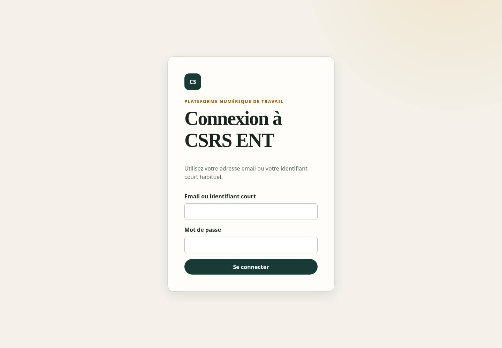

** Remplacer un mot de passe temporaire
:PROPERTIES:
:CUSTOM_ID: proc-mot-de-passe
:END:

1. Se connecter avec le mot de passe temporaire transmis par l'administration IT.
2. Dans l'écran obligatoire, saisir le mot de passe temporaire, le nouveau mot de passe et sa confirmation.
3. Sélectionner =Enregistrer= et attendre le rechargement de la session.
4. Ne poursuivre que lorsque le menu normal apparaît.

Le mot de passe temporaire n'est affiché qu'une fois à l'administrateur. Il ne doit pas être placé dans une observation, un email collectif, une capture ou un document partagé.

** Utiliser la navigation sur ordinateur et téléphone
:PROPERTIES:
:CUSTOM_ID: proc-navigation
:END:

Le menu regroupe les rubriques dans =Travail=, =Pilotage= et =Administration=. Sur ordinateur, utiliser =Réduire= ou =Déployer= pour changer la largeur de la barre; le choix reste mémorisé dans le navigateur. Sur téléphone, sélectionner =Ouvrir le menu=, choisir une rubrique puis laisser le tiroir se fermer. La touche =Échap= ferme aussi le tiroir et rend le focus au bouton d'ouverture.

Le lien =Aller au contenu= permet de contourner directement la navigation au clavier. Une rubrique ouverte est visuellement indiquée et les groupes peuvent être repliés sans perdre les droits ni les données.

#+CAPTION: Navigation mobile d'un agent; les outils non autorisés sont absents.
#+ATTR_HTML: :alt "Menu mobile de CSRS ENT ouvert pour un agent" :width "360"
#+ATTR_LATEX: :width 0.4\linewidth :placement [H]
#+ATTR_ODT: :width 6.0
#+ATTR_ORG: :width 360
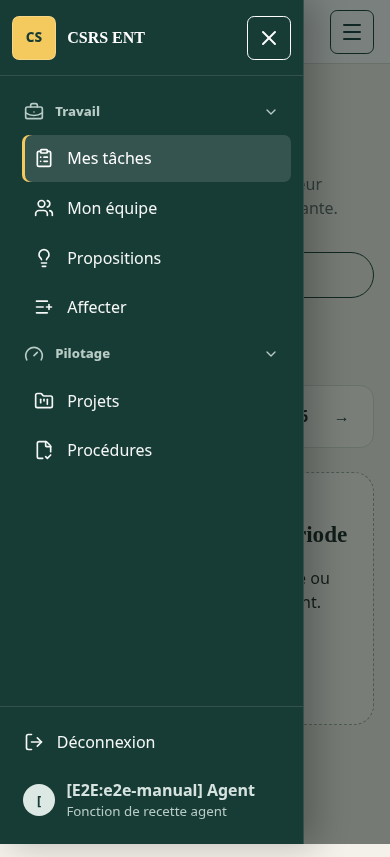

#+CAPTION: Navigation complète de l'administration IT organisée en trois groupes.
#+ATTR_HTML: :alt "Menu CSRS ENT de l'administration IT avec Travail Pilotage et Administration" :width "100%"
#+ATTR_LATEX: :width 0.95\linewidth :placement [H]
#+ATTR_ODT: :width 16.0
#+ATTR_ORG: :width 1000
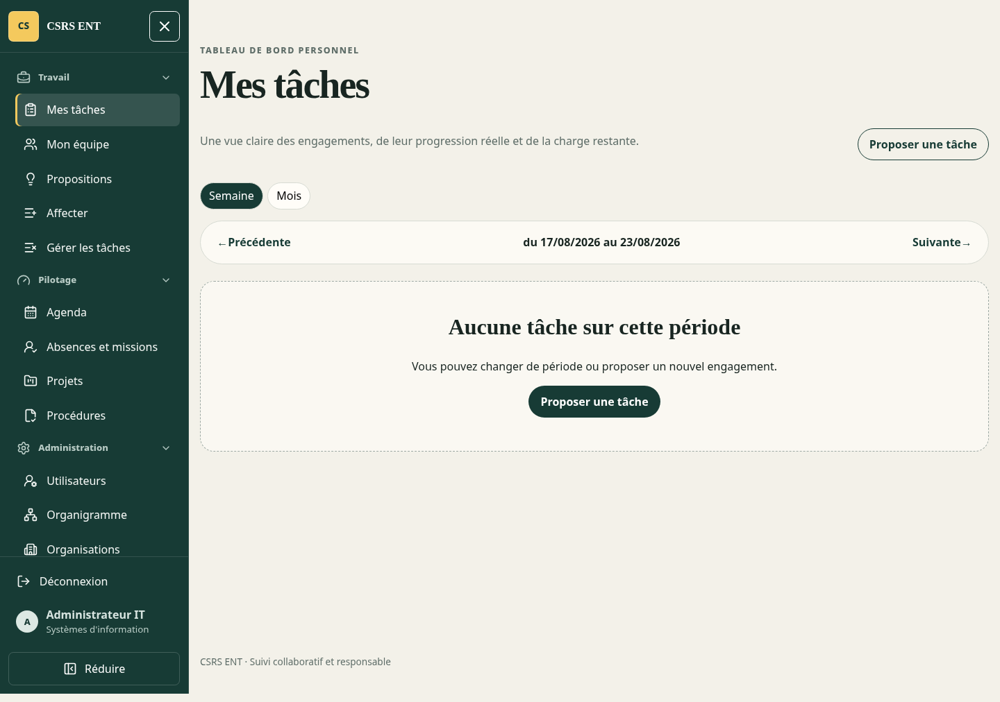

** Comprendre les confirmations et conflits de révision
:PROPERTIES:
:CUSTOM_ID: proc-conflit
:END:

Une bannière indiquant que la ressource a changé signifie qu'une version plus récente existe dans Odoo. Sélectionner =Actualiser= ou recharger la page, relire les nouvelles données puis recommencer l'opération. Ne pas tenter de reproduire aveuglément l'ancienne saisie, car la décision récente peut modifier le contexte.

Les actions irréversibles exigent un motif et parfois une phrase exacte comme =SUPPRIMER= ou =VALIDÉ LE jj/mm/aaaa=. La phrase prouve une décision explicite; elle ne remplace ni l'autorisation Odoo ni le contrôle de révision.

** Utiliser les dates, périodes, charges et fichiers
:PROPERTIES:
:CUSTOM_ID: proc-saisie
:END:

Les dates sont affichées en français et disposent d'un calendrier. Dans les tableaux de bord, choisir =Semaine= ou =Mois= puis utiliser =Précédente= et =Suivante=. Dans l'agenda, une plage libre peut couvrir au maximum 31 jours inclusifs.

La charge est saisie en =heures= par défaut dans les nouveaux formulaires. Choisir =jours= si cette unité est plus naturelle. Une valeur décimale, par exemple =1,5 heure=, est conservée; contrôler l'équivalence affichée sous le champ avant d'enregistrer.

Les avatars acceptent JPEG ou PNG. Le document TOR accepte PDF, DOC ou DOCX. Chaque fichier de profil est limité à 5 Mo. Les preuves de notification de paiement acceptent PDF, JPEG ou PNG. Vérifier le fichier avant l'envoi, car les pièces appartiennent ensuite au dossier audité.

* Tâches et propositions

** Choisir la période et lire le tableau de bord
:PROPERTIES:
:CUSTOM_ID: proc-tableau-bord
:END:

1. Sélectionner =Mes tâches= dans =Travail=.
2. Choisir =Semaine= ou =Mois=.
3. Utiliser les périodes précédente et suivante jusqu'à afficher la période recherchée.
4. Lire sur chaque carte le code, le statut, le pourcentage, la charge restante et les dates.
5. Sélectionner le titre de la tâche pour ouvrir son détail.

Si la période est vide, changer d'abord de semaine ou de mois. Le bouton =Proposer une tâche= reste disponible pour soumettre un nouvel engagement.

#+CAPTION: Tableau de bord mensuel d'un agent avec progression et charge.
#+ATTR_HTML: :alt "Cartes de tâches du tableau de bord personnel" :width "100%"
#+ATTR_LATEX: :width 0.95\linewidth :placement [H]
#+ATTR_ODT: :width 16.0
#+ATTR_ORG: :width 1000
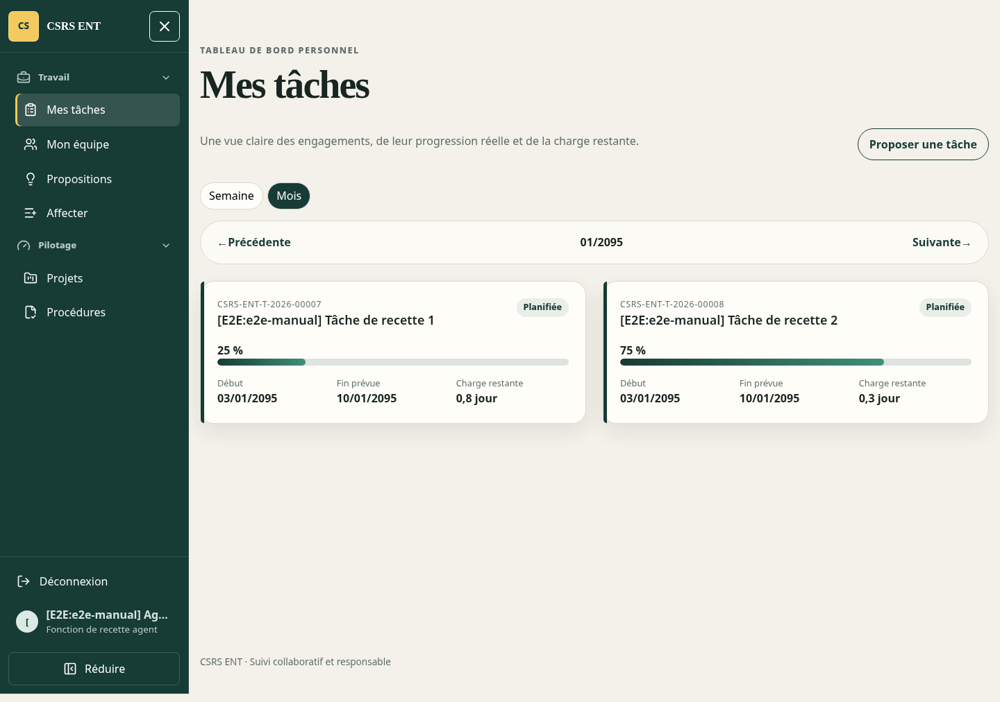

** Lire le détail et le graphique d'une tâche
:PROPERTIES:
:CUSTOM_ID: proc-lire-tache
:END:

Le haut de la page affiche le code, le titre, le statut et le pourcentage. La grille distingue le début, la date du jour, la fin prévue, la charge initiale, la charge réalisée et la charge restante. La description et l'action institutionnelle éventuelle se trouvent sous le graphique.

Le graphique place les dates sur l'axe horizontal et la progression sur l'axe vertical. Les points réels correspondent aux saisies enregistrées; l'aperçu suit le curseur avant l'enregistrement. Une zone de retard apparaît lorsque l'échéance est dépassée. Utiliser la table alternative ou les flèches du clavier sur le graphique pour lire les valeurs sans dépendre de la représentation visuelle.

#+CAPTION: Détail d'une tâche avec dates, charges, graphique et conversation.
#+ATTR_HTML: :alt "Détail complet d'une tâche et graphique de progression" :width "100%"
#+ATTR_LATEX: :width 0.95\linewidth :placement [H]
#+ATTR_ODT: :width 16.0
#+ATTR_ORG: :width 1000
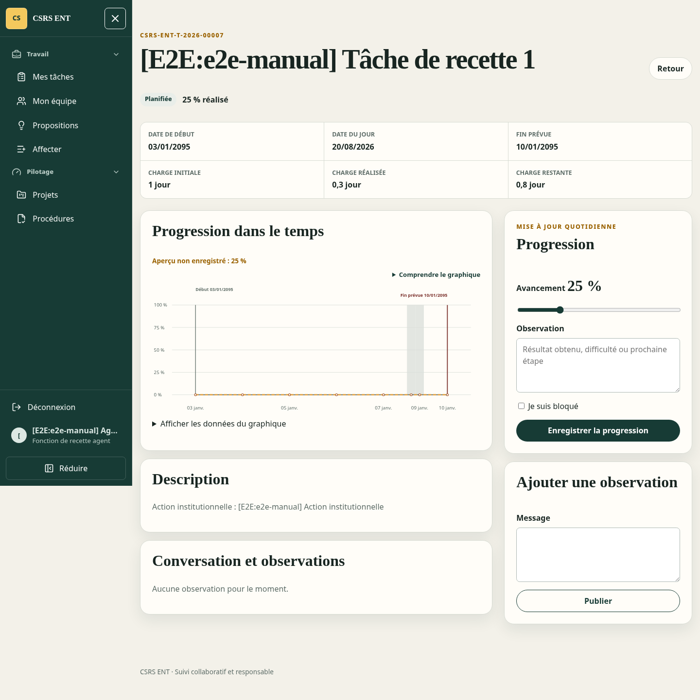

** Mettre à jour la progression et publier une observation
:PROPERTIES:
:CUSTOM_ID: proc-progression
:END:

1. Ouvrir la tâche selon [[#proc-tableau-bord][Choisir la période et lire le tableau de bord]].
2. Déplacer le curseur =Avancement= par pas de 5 %.
3. Saisir une observation décrivant le résultat, la difficulté ou la prochaine étape.
4. Cocher =Je suis bloqué= si un obstacle empêche réellement la suite; une tâche personnelle de la DG utilise le libellé =Signaler un point d'attention=.
5. Sélectionner =Enregistrer la progression= et attendre la confirmation.

Une observation est obligatoire lorsque le pourcentage diminue ou qu'un blocage est signalé. Une valeur à 100 % place la tâche en attente de validation; elle ne clôture pas automatiquement le travail.

Pour publier un message sans changer le pourcentage, saisir le texte dans =Ajouter une observation= puis sélectionner =Publier=. Vérifier l'auteur, la date et le type dans =Conversation et observations=. Une correction doit être publiée comme une nouvelle précision plutôt que masquer une information historique.

#+CAPTION: Commandes de progression, blocage et observation.
#+ATTR_HTML: :alt "Formulaire de progression et formulaire d'observation d'une tâche" :width "100%"
#+ATTR_LATEX: :width 0.95\linewidth :placement [H]
#+ATTR_ODT: :width 16.0
#+ATTR_ORG: :width 1000
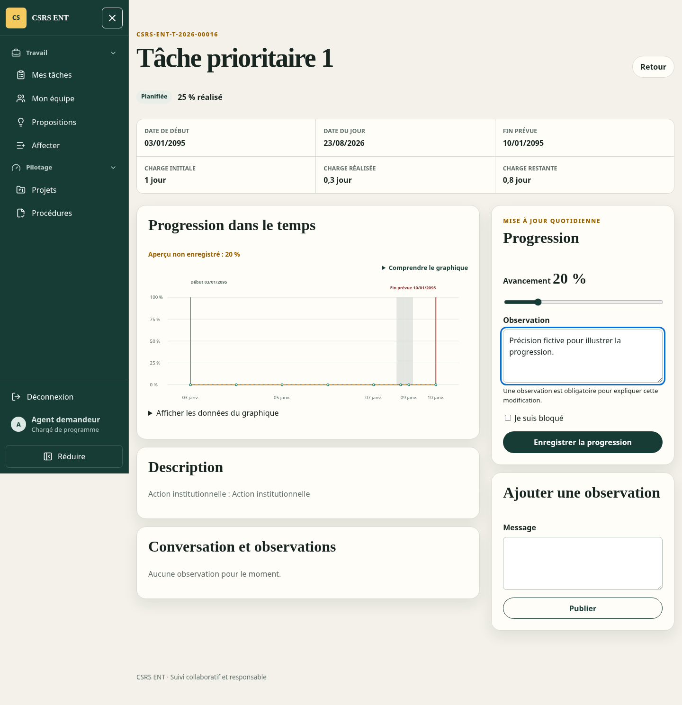

** Valider, remettre en reprise ou clôturer une tâche
:PROPERTIES:
:CUSTOM_ID: proc-decision-tache
:END:

1. Le responsable principal ouvre une tâche à =À valider=.
2. Relire la description, la progression et les observations.
3. Sélectionner =Valider l'achèvement= si le résultat est accepté.
4. Pour une reprise, saisir un motif vérifiable puis sélectionner =Demander une reprise=.
5. Pour arrêter une tâche avant 100 %, saisir le motif de clôture anticipée puis sélectionner =Clôturer avant achèvement=.

Le responsable secondaire peut consulter et commenter, mais ne peut ni modifier la progression, ni valider, ni fermer. La clôture anticipée est définitive dans le cycle courant et son motif reste audité.

#+CAPTION: Décisions disponibles au responsable principal sur une tâche à valider.
#+ATTR_HTML: :alt "Actions de validation reprise et clôture sur une tâche" :width "100%"
#+ATTR_LATEX: :width 0.95\linewidth :placement [H]
#+ATTR_ODT: :width 16.0
#+ATTR_ORG: :width 1000
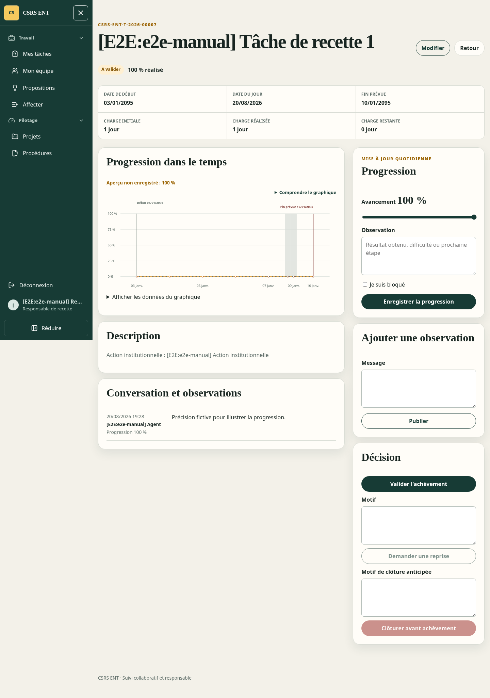

** Proposer une tâche
:PROPERTIES:
:CUSTOM_ID: proc-proposer-tache
:END:

1. Sélectionner =Propositions= puis =Nouvelle proposition=, ou utiliser =Proposer une tâche= depuis le tableau de bord.
2. Saisir un nom court et une description du résultat vérifiable.
3. Choisir éventuellement une action institutionnelle.
4. Saisir la date de début.
5. Modifier la fin prévue ou la charge; le calendrier de travail recalcule l'autre valeur.
6. Choisir l'unité =heures= ou =jours= et contrôler l'équivalence.
7. Sélectionner =Soumettre=.
8. Retrouver la proposition dans la liste et suivre son statut.

#+CAPTION: Formulaire de proposition avec charge en heures ou en jours.
#+ATTR_HTML: :alt "Formulaire pour proposer une tâche avec dates et charge" :width "100%"
#+ATTR_LATEX: :width 0.95\linewidth :placement [H]
#+ATTR_ODT: :width 16.0
#+ATTR_ORG: :width 1000
[[file:screenshots/08-proposition-form.png]]

** Examiner, corriger et accepter une proposition
:PROPERTIES:
:CUSTOM_ID: proc-examiner-proposition
:END:

Le demandeur utilise les filtres de statut et de période pour retrouver ses propositions. Le responsable peut également filtrer par collaborateur.

1. Ouvrir une proposition soumise.
2. Vérifier le titre, la description, le collaborateur, les dates, la charge et l'action institutionnelle.
3. Sélectionner =Accepter= pour créer la tâche Odoo et conserver le lien avec la proposition.
4. Pour refuser, saisir le motif puis sélectionner =Rejeter=.
5. Le demandeur ouvre ensuite la proposition rejetée, sélectionne =Modifier=, applique la correction et la soumet de nouveau.
6. Après acceptation, utiliser =Ouvrir la tâche créée= pour suivre la progression.

L'acceptation est atomique: la proposition ne doit pas apparaître acceptée si la tâche n'a pas été créée.

#+CAPTION: Examen d'une proposition soumise par un responsable.
#+ATTR_HTML: :alt "Carte de proposition et décisions du responsable" :width "100%"
#+ATTR_LATEX: :width 0.95\linewidth :placement [H]
#+ATTR_ODT: :width 16.0
#+ATTR_ORG: :width 1000
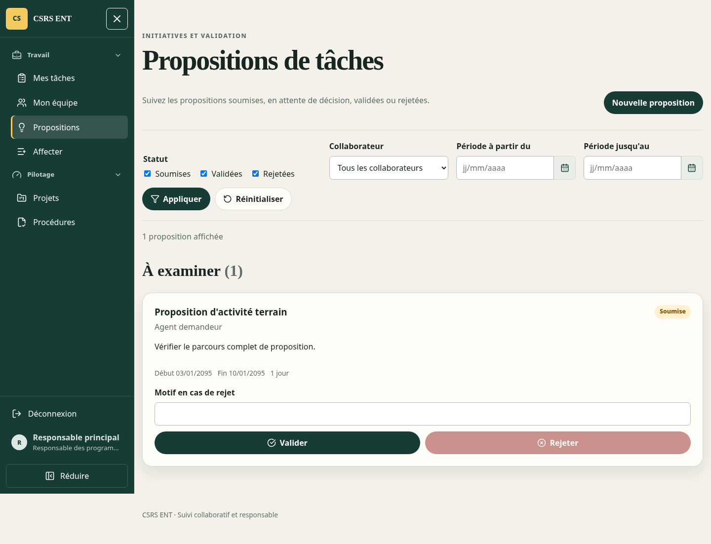

** Créer ou modifier directement une tâche
:PROPERTIES:
:CUSTOM_ID: proc-affecter
:END:

1. Sélectionner =Affecter=.
2. Choisir le collaborateur dans le périmètre autorisé.
3. Saisir le titre, la description et l'action institutionnelle éventuelle.
4. Définir le début, la fin prévue et la charge en heures ou en jours.
5. Sélectionner =Enregistrer= et contrôler le détail créé.

La liste des collaborateurs dépend de la hiérarchie et des délégations actives. Une modification ultérieure conserve le même contrôle de révision.

#+CAPTION: Attribution directe d'une tâche par un responsable.
#+ATTR_HTML: :alt "Formulaire d'affectation directe d'une tâche" :width "100%"
#+ATTR_LATEX: :width 0.95\linewidth :placement [H]
#+ATTR_ODT: :width 16.0
#+ATTR_ORG: :width 1000
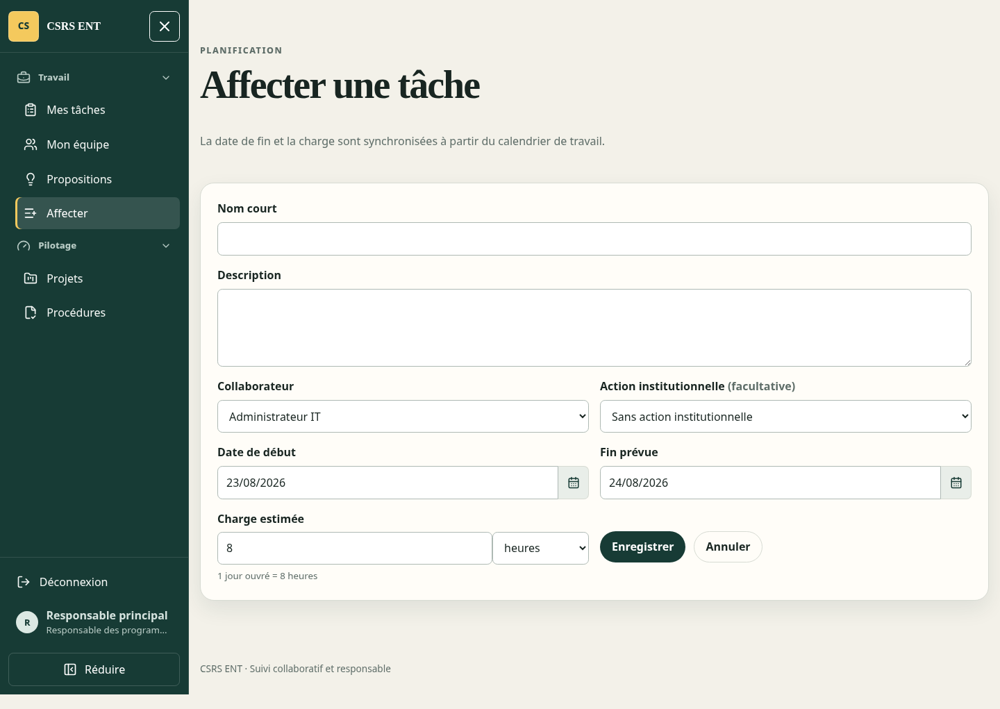

** Consulter l'équipe et le profil professionnel
:PROPERTIES:
:CUSTOM_ID: proc-equipe
:END:

1. Sélectionner =Mon équipe=.
2. Choisir la période et le filtre =Tous=, =Avec tâches= ou =Sans tâche=.
3. Ouvrir une branche pour charger les tâches du collaborateur et ses sous-équipes.
4. Lire les statuts, progressions, charges restantes, blocages et dates.
5. Sélectionner =Voir la fiche complète= pour ouvrir le profil et l'ensemble des tâches de la période.

Le filtre s'applique récursivement: une branche peut rester visible uniquement pour donner accès à un descendant correspondant. L'ouverture d'une branche ne doit pas être confondue avec l'ouverture du profil.

#+CAPTION: Synthèse hiérarchique et tâches d'une équipe.
#+ATTR_HTML: :alt "Arbre d'équipe avec collaborateurs et tâches" :width "100%"
#+ATTR_LATEX: :width 0.95\linewidth :placement [H]
#+ATTR_ODT: :width 16.0
#+ATTR_ORG: :width 1000
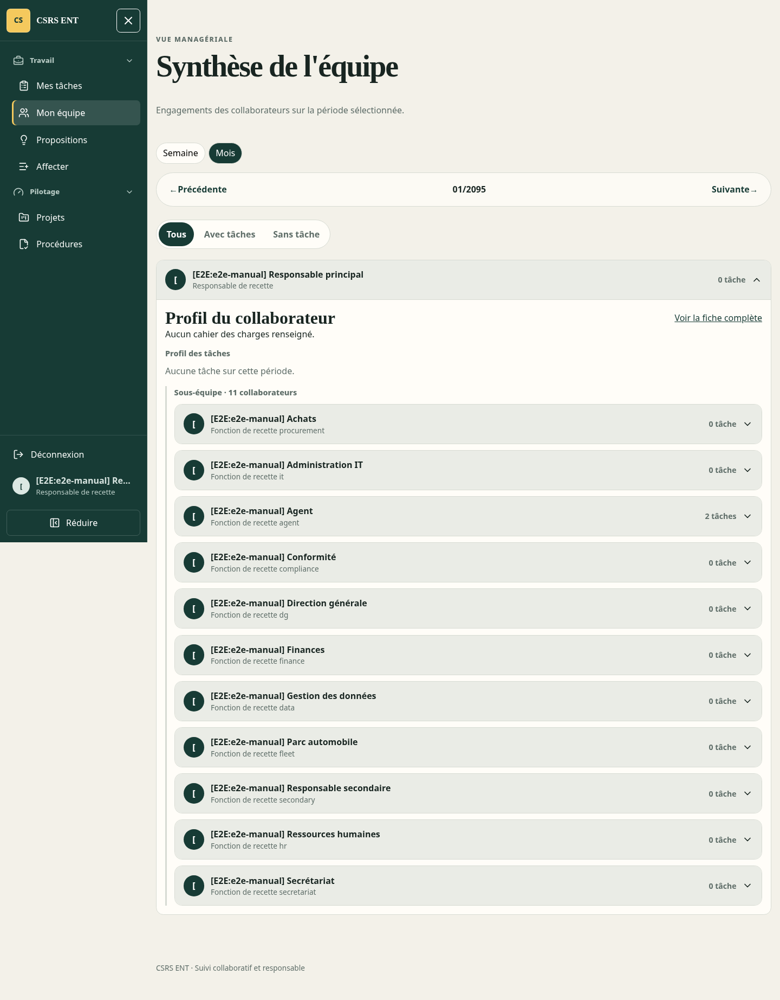

Seul l'employé modifie son propre profil. Sélectionner =Modifier mon profil=, saisir les missions et responsabilités, joindre éventuellement l'avatar et le document TOR, puis sélectionner =Enregistrer le profil=. Les cases de suppression retirent les fichiers actuels lors de la sauvegarde. Les responsables autorisés consultent et téléchargent sans modifier.

#+CAPTION: Modification du profil, de l'avatar et du cahier des charges.
#+ATTR_HTML: :alt "Profil professionnel avec missions avatar et document TOR" :width "100%"
#+ATTR_LATEX: :width 0.95\linewidth :placement [H]
#+ATTR_ODT: :width 16.0
#+ATTR_ORG: :width 1000

* Absences, visites et agendas de direction

** Déclarer, modifier ou annuler une indisponibilité
:PROPERTIES:
:CUSTOM_ID: proc-absence
:END:

Pendant la période de coexistence, les absences restent saisies dans =CSRS Report= à l'adresse =https://179.237.107.40/app/=. CSRS ENT les affiche après la synchronisation quotidienne mais refuse toute modification afin d'éviter deux versions concurrentes.

Dans =CSRS Report= :

1. Le compte RH ouvre =Absences et missions=.
2. Choisir la semaine avec le sélecteur de date.
3. Choisir l'agent, la nature, le début, la fin et l'observation facultative.
4. Sélectionner =Ajouter= ou =Enregistrer= lors d'une modification.
5. Pour corriger une ligne, sélectionner =Modifier=, enregistrer puis contrôler la liste.
6. Pour annuler, sélectionner =Annuler= et saisir le motif demandé.

En cas d'échec d'annulation, la ligne reste visible et un message explique que la modification n'a pas été enregistrée. Ne pas considérer la période annulée avant la confirmation.

#+CAPTION: Saisie RH des congés, absences et missions.
#+ATTR_HTML: :alt "Écran RH de gestion des indisponibilités" :width "100%"
#+ATTR_LATEX: :width 0.95\linewidth :placement [H]
#+ATTR_ODT: :width 16.0
#+ATTR_ORG: :width 1000
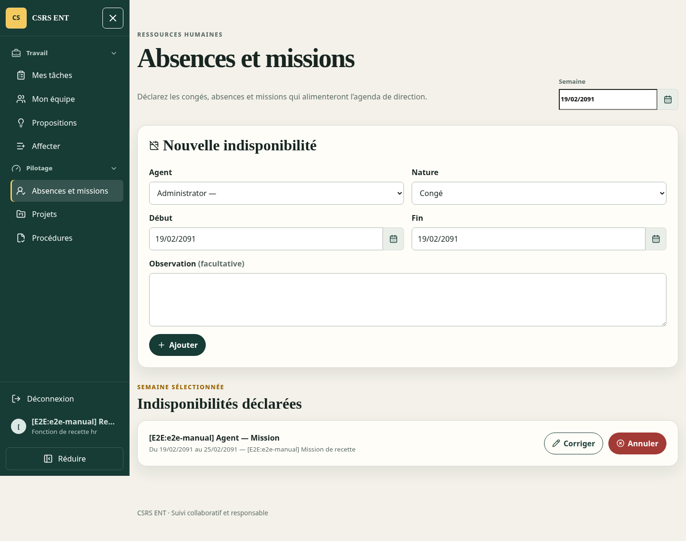

** Enregistrer les visiteurs
:PROPERTIES:
:CUSTOM_ID: proc-visiteurs
:END:

Le secrétariat ouvre =Agenda= dans =CSRS Report=. Dans =Visiteurs=, saisir le nombre de personnes et, si disponible, les noms, puis enregistrer l'arrivée. Vérifier la visite dans la liste en cours. Au départ, sélectionner l'action correspondante; l'arrivée et le départ alimentent l'aperçu de la période. Dans CSRS ENT, ces données sont consultables après synchronisation et ne sont pas modifiables.

** Préparer le brouillon et choisir la période
:PROPERTIES:
:CUSTOM_ID: proc-agenda
:END:

1. Ouvrir =Agenda= dans =CSRS Report= avec le compte secrétariat.
2. Sélectionner le bouton de période. Choisir d'abord la date de début, puis la date de fin dans le calendrier unique.
3. Utiliser =Appliquer= seulement lorsque la plage est correcte. =Annuler= ferme le panneau sans changer l'agenda. =Semaine prochaine= applique directement le lundi au dimanche proposés.
4. Saisir les événements majeurs ou =RAS=.
5. Choisir =Direction des programmes= ou =Direction administrative=. Ce sont les deux seules directions de publication courantes.
6. Contrôler les arrivées, départs, indisponibilités, services, tâches, pourcentages et observations.
7. Traiter l'avertissement =Personnes non classées= avec l'administration IT; leurs tâches apparaissent dans tous les agendas jusqu'au classement.
8. Sélectionner =Enregistrer le brouillon= pour conserver la préparation commune.

Pendant un changement de période, le dernier agenda reste affiché. Si le chargement échoue, utiliser =Réessayer= dans l'avertissement local.

#+CAPTION: Préparation du brouillon, des visiteurs et de la période par le secrétariat.
#+ATTR_HTML: :alt "Écran de préparation d'un agenda de direction" :width "100%"
#+ATTR_LATEX: :width 0.95\linewidth :placement [H]
#+ATTR_ODT: :width 16.0
#+ATTR_ORG: :width 1000
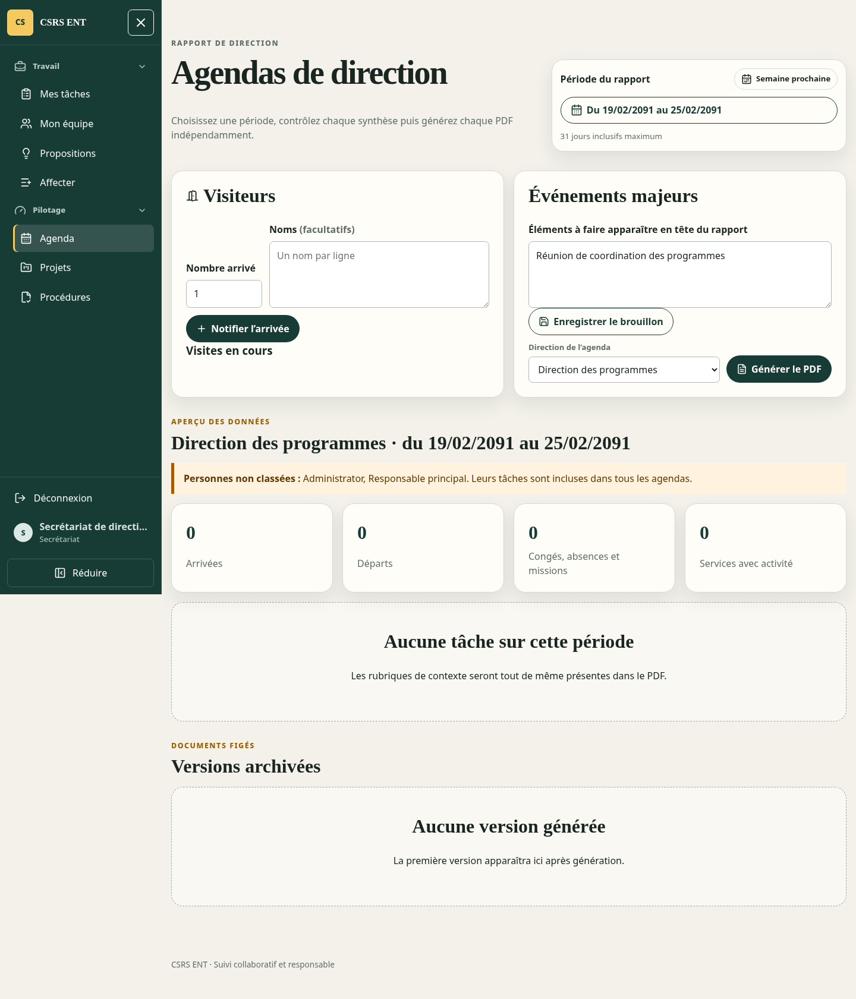

#+CAPTION: Aperçu d'un agenda avec sa direction, ses synthèses et ses avertissements.
#+ATTR_HTML: :alt "Aperçu détaillé d'un agenda de direction" :width "100%"
#+ATTR_LATEX: :width 0.95\linewidth :placement [H]
#+ATTR_ODT: :width 16.0
#+ATTR_ORG: :width 1000

** Générer, archiver et consulter les PDF
:PROPERTIES:
:CUSTOM_ID: proc-agenda-pdf
:END:

La génération se fait dans =CSRS Report= tant que le bandeau =Consultation synchronisée= est visible dans CSRS ENT.

1. Enregistrer le brouillon et choisir la direction attendue dans =CSRS Report=.
2. Sélectionner =Générer le PDF=.
3. Attendre le message confirmant que la version est archivée.
4. Changer de direction et recommencer pour produire un autre support; chaque direction possède ses propres versions.
5. Dans les versions archivées, contrôler la période, la direction et le numéro puis ouvrir le PDF.

Chaque génération crée une version figée. Une correction ultérieure produit une nouvelle version sans remplacer les archives. La DG consulte et réimprime les versions en lecture seule; elle demande au secrétariat une nouvelle génération lorsqu'une correction est nécessaire.

** Contrôler la synchronisation temporaire
:PROPERTIES:
:CUSTOM_ID: proc-agenda-synchronisation
:END:

CSRS ENT affiche un bandeau jaune lorsque la source de saisie reste =CSRS Report=. Le bandeau donne la date de la dernière synchronisation réussie et un lien direct vers la source. Les tâches, visites, indisponibilités, brouillons et PDF historiques sont recopiés chaque jour. Une donnée saisie après le dernier passage peut donc être absente jusqu'au passage suivant.

Pour un besoin urgent, l'exploitant lance depuis la version déployée :

#+begin_src sh
./scripts/sync_csrs_legacy.sh /srv/apps/csrs-ent-preprod/config/.env jil@179.237.107.40
#+end_src

La commande effectue d'abord une simulation complète. Elle n'applique la réconciliation que si les références, tailles et empreintes SHA-256 sont valides. En cas d'échec, conserver CSRS ENT en consultation, corriger la source ou l'accès distant, puis relancer; ne pas saisir la même donnée dans les deux applications.

#+CAPTION: Versions PDF archivées accessibles au secrétariat et à la Direction générale.
#+ATTR_HTML: :alt "Liste des versions archivées des agendas" :width "100%"
#+ATTR_LATEX: :width 0.95\linewidth :placement [H]
#+ATTR_ODT: :width 16.0
#+ATTR_ORG: :width 1000
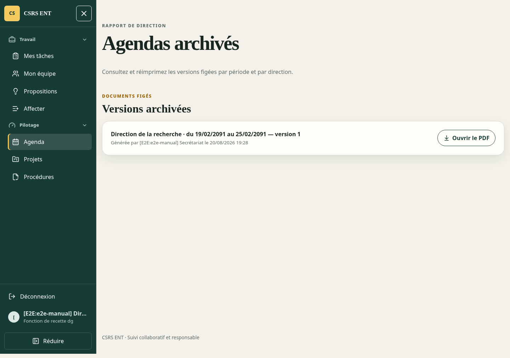

* Projets de recherche

** Comprendre les trois vues de projets
:PROPERTIES:
:CUSTOM_ID: proc-projets-listes
:END:

=Mes projets= contient les projets proposés ou conduits par la personne. =À superviser= contient les projets du périmètre hiérarchique, y compris les sous-unités. =Archivés= conserve les dossiers retirés des vues actives. Ouvrir une carte pour accéder au parcours numéroté.

#+CAPTION: Projets personnels, supervisés et archivés dans une vue unique.
#+ATTR_HTML: :alt "Liste des projets avec les vues Mes projets À superviser et Archivés" :width "100%"
#+ATTR_LATEX: :width 0.95\linewidth :placement [H]
#+ATTR_ODT: :width 16.0
#+ATTR_ORG: :width 1000
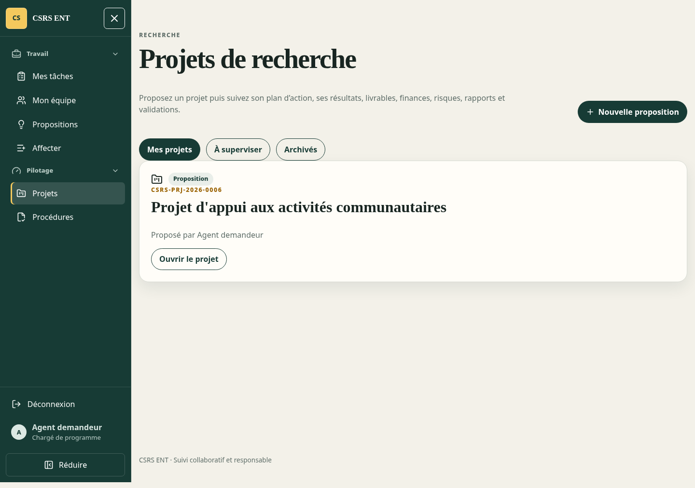

** Proposer un projet
:PROPERTIES:
:CUSTOM_ID: proc-proposer-projet
:END:

1. Ouvrir =Projets= puis sélectionner =Proposer un projet=.
2. Saisir l'intitulé, les objectifs et les engagements institutionnels.
3. Choisir éventuellement un bailleur et plusieurs partenaires parmi les organisations existantes.
4. Choisir les membres de l'équipe.
5. Saisir le début et la fin prévisionnels.
6. Sélectionner =Enregistrer la proposition=.

Le formulaire ne crée jamais un bailleur ni un partenaire. Si l'organisation manque, demander à l'administration IT de la créer avant de continuer. Les engagements institutionnels doivent distinguer clairement ce que chaque partenaire fournit.

#+CAPTION: Proposition de projet avec équipe, bailleur et partenaires existants.
#+ATTR_HTML: :alt "Formulaire de proposition d'un projet de recherche" :width "100%"
#+ATTR_LATEX: :width 0.95\linewidth :placement [H]
#+ATTR_ODT: :width 16.0
#+ATTR_ORG: :width 1000
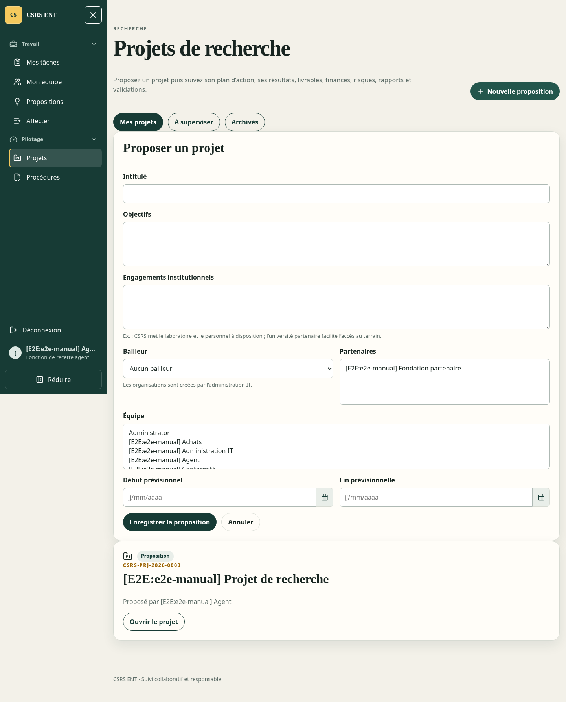

** Autoriser le projet et parcourir les dix écrans
:PROPERTIES:
:CUSTOM_ID: proc-parcours-projet
:END:

La DG ouvre la proposition, relit la fiche puis sélectionne =Autoriser et nommer le proposant= ou =Rejeter=. L'autorisation désigne le chef de projet et rend le dossier actif.

Le parcours contient: 1. Projet, 2. Plan d'action, 3. Résultats, 4. Livrables, 5. Finances, 6. Conformité, 7. Risques, 8. Rapports, 9. Clôture et 10. Récapitulatif. Les sections Projet, Plan d'action, Finances et Clôture sont obligatoires. Une étape obligatoire suivante s'ouvre lorsque les brouillons obligatoires précédents sont complets; une étape facultative ne bloque pas la suite. Une demande directe vers une étape verrouillée revient à la fiche projet avec une explication.

#+CAPTION: Parcours numéroté, états et verrouillage des dix écrans d'un projet.
#+ATTR_HTML: :alt "Parcours en dix étapes d'un projet de recherche" :width "100%"
#+ATTR_LATEX: :width 0.98\linewidth :placement [H]
#+ATTR_ODT: :width 16.0
#+ATTR_ORG: :width 1400
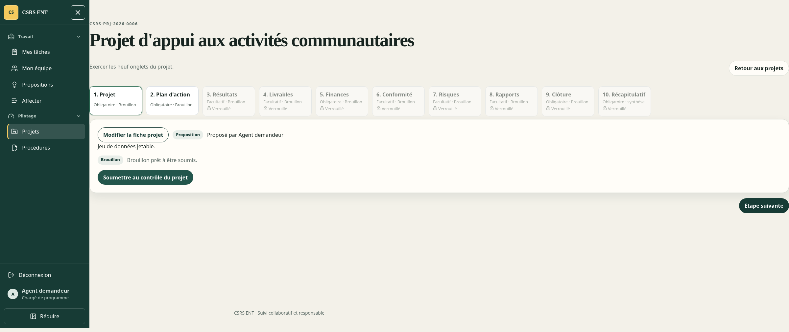

** Compléter le plan d'action
:PROPERTIES:
:CUSTOM_ID: proc-plan-action
:END:

1. Ouvrir =2. Plan d'action= puis =Ouvrir le brouillon=.
2. Saisir l'activité, la description, le responsable, le début, l'échéance et la charge.
3. Choisir la charge en heures ou en jours puis enregistrer.
4. Vérifier l'activité dans la liste. Elle devient une tâche Odoo suivie avec sa progression.
5. Ajouter toutes les activités requises avant de soumettre la section.

#+CAPTION: Brouillon d'une activité du plan d'action avec responsable et charge.
#+ATTR_HTML: :alt "Formulaire d'activité du plan d'action d'un projet" :width "100%"
#+ATTR_LATEX: :width 0.95\linewidth :placement [H]
#+ATTR_ODT: :width 16.0
#+ATTR_ORG: :width 1000
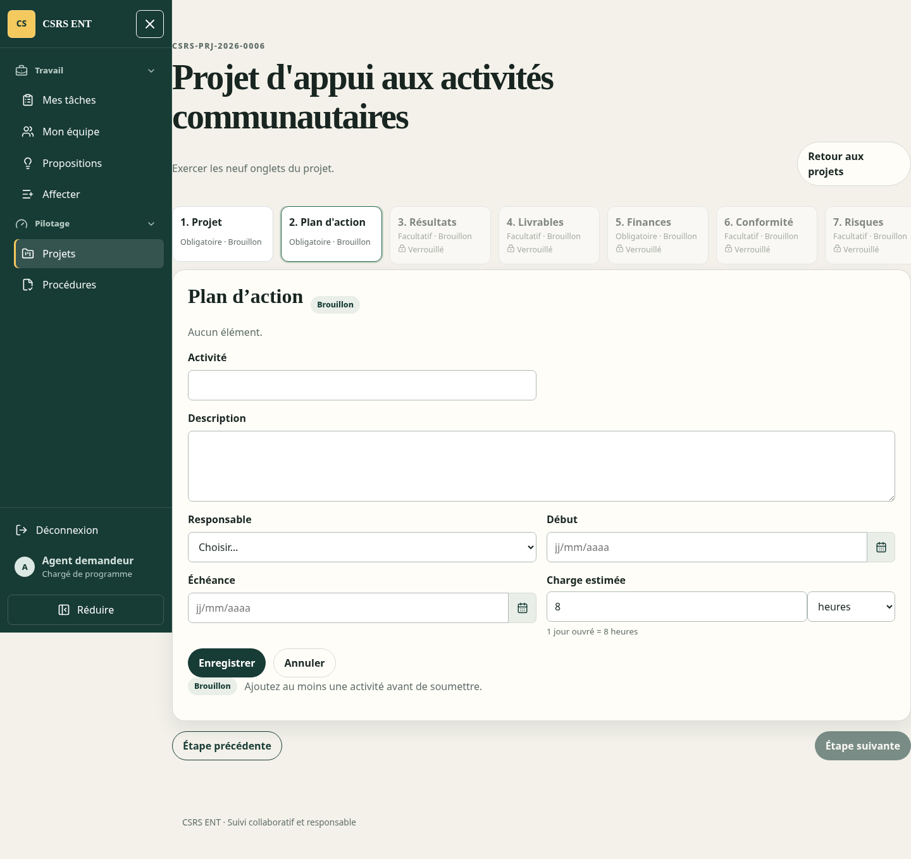

** Compléter les autres sections

| Section | Informations principales | Condition notable |
|---------+--------------------------+-------------------|
| Résultats | Résultat, indicateur, cible, réalisation | La réalisation peut être complétée plus tard |
| Livrables | Nom, échéance, version, indicateur de risque | Le risque doit être revu avant soumission |
| Finances | Code, ligne budgétaire, montant prévu | Au moins une ligne est obligatoire |
| Conformité | Type, exigence, responsable, échéance | Types: éthique, contrat, achat, bailleur ou autre |
| Risques | Probabilité, impact, responsable, traitement | Probabilité et impact utilisent une échelle de 1 à 5 |
| Rapports | Type, période et échéance | Types technique, financier ou final |
| Clôture | Bilan, équipements, données, solde, perspectives, passifs et durabilité | Un seul brouillon de clôture est créé |

#+CAPTION: Ligne financière d'un projet et contrôle du budget disponible.
#+ATTR_HTML: :alt "Formulaire de ligne budgétaire d'un projet" :width "100%"
#+ATTR_LATEX: :width 0.95\linewidth :placement [H]
#+ATTR_ODT: :width 16.0
#+ATTR_ORG: :width 1000
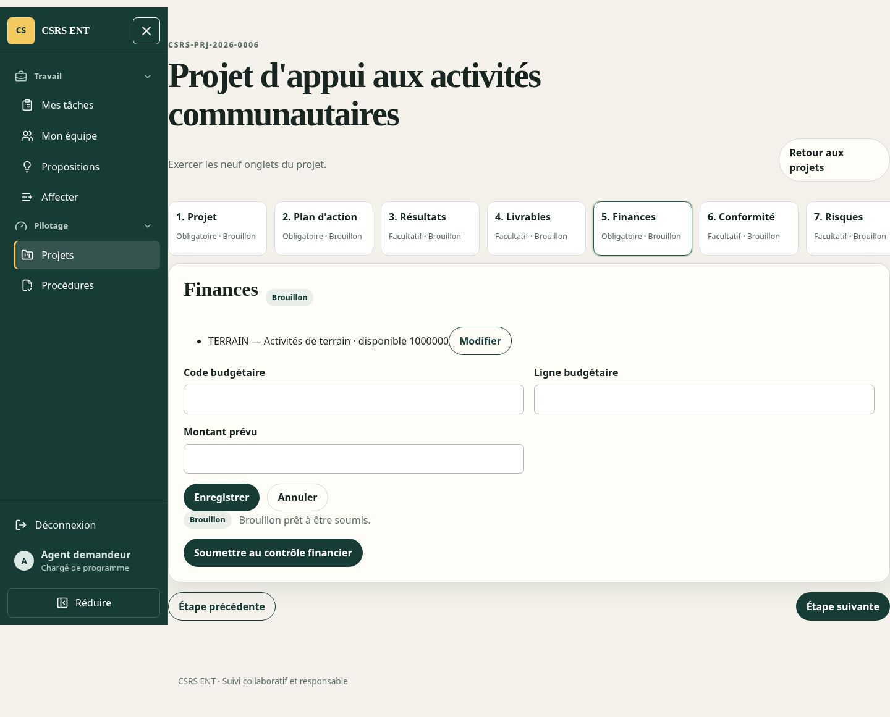

** Soumettre, vérifier, corriger, valider et clôturer une section
:PROPERTIES:
:CUSTOM_ID: proc-section-projet
:END:

1. Le porteur ou chef de projet complète le brouillon puis sélectionne =Soumettre au contrôle du projet=, =Soumettre au contrôle financier= ou =Soumettre au contrôle conformité=.
2. Le contrôleur sélectionne =Vérifier= ou =Demander correction=. Une correction exige un motif.
3. Après vérification, la DG sélectionne =Valider électroniquement= et saisit exactement la phrase affichée.
4. Après validation, sélectionner =Clôturer l'onglet= lorsque le travail de la section est terminé.

Le cycle est =Brouillon -> Soumis -> À corriger ou Vérifié -> Validé -> Clôturé=. Après soumission, les éléments sont en lecture seule jusqu'à une correction. La preuve électronique conserve la phrase, le signataire, la date, la révision et une empreinte du contenu.

#+CAPTION: État d'une section et actions de soumission, contrôle et validation.
#+ATTR_HTML: :alt "Commandes de gouvernance d'une section de projet" :width "100%"
#+ATTR_LATEX: :width 0.95\linewidth :placement [H]
#+ATTR_ODT: :width 16.0
#+ATTR_ORG: :width 1000
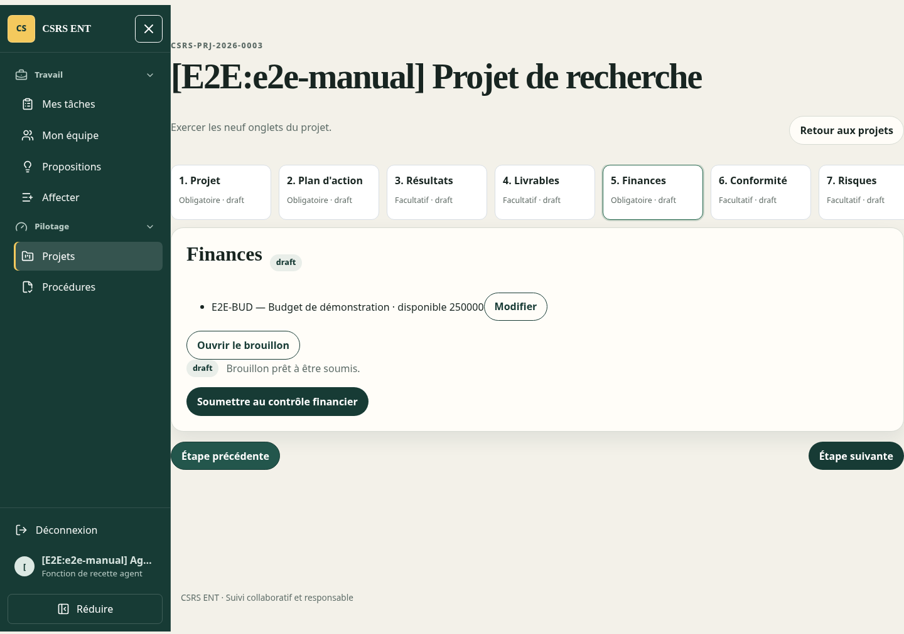

** Superviser, archiver et lire le récapitulatif
:PROPERTIES:
:CUSTOM_ID: proc-superviser-projet
:END:

Le responsable, la DG et l'administration IT utilisent =À superviser=. Ils peuvent ouvrir les projets de leur périmètre récursif, relire les sections et demander une correction selon leurs capacités. Pour archiver, sélectionner =Archiver=, saisir le motif puis confirmer. Le projet quitte les vues actives sans perdre ses sections, tâches, partenaires ni événements.

Le récapitulatif présente les activités réalisées, le budget prévu, engagé, dépensé et disponible, la gouvernance et l'état des neuf sections. Le projet global ne peut être clôturé que lorsque toutes les sections sont clôturées.

#+CAPTION: Supervision d'un projet et action d'archivage motivée.
#+ATTR_HTML: :alt "Projet supervisé avec gouvernance et commande d'archivage" :width "100%"
#+ATTR_LATEX: :width 0.95\linewidth :placement [H]
#+ATTR_ODT: :width 16.0
#+ATTR_ORG: :width 1000
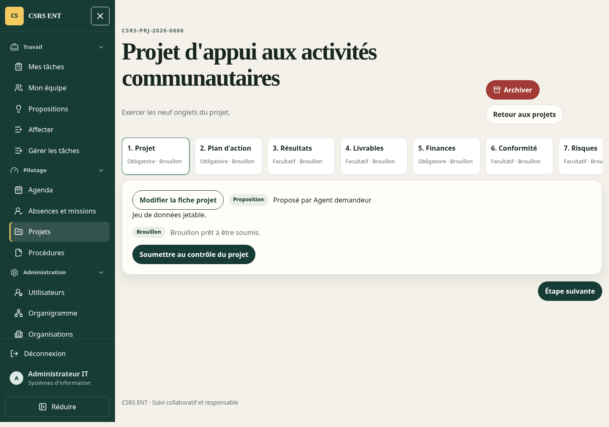

* Procédures métier

** Créer et suivre un dossier
:PROPERTIES:
:CUSTOM_ID: proc-dossier
:END:

1. Sélectionner =Procédures= puis =Nouveau dossier=.
2. Choisir le type de procédure; les champs spécifiques apparaissent automatiquement.
3. Choisir l'unité d'origine, saisir l'objet et la description.
4. Pour un BSF ou un achat, choisir le projet et la ligne budgétaire correspondante.
5. Renseigner les champs spécifiques et joindre la preuve demandée.
6. Sélectionner =Créer le brouillon=.
7. Ouvrir le dossier et sélectionner =Soumettre=.

#+CAPTION: Formulaire dynamique d'un nouveau dossier métier.
#+ATTR_HTML: :alt "Formulaire de procédure avec champs adaptés au type choisi" :width "100%"
#+ATTR_LATEX: :width 0.95\linewidth :placement [H]
#+ATTR_ODT: :width 16.0
#+ATTR_ORG: :width 1000
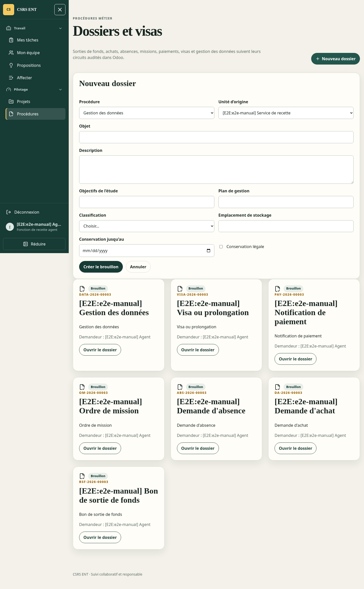

Le détail affiche la référence, l'état, le demandeur, l'unité, les données du formulaire, les actions actuellement autorisées et l'historique audité. Seul le rôle attendu voit l'action de l'étape. Une demande de correction ou un rejet exige un motif. Le demandeur corrige le même dossier puis utilise =Soumettre à nouveau=; les événements antérieurs restent visibles.

#+CAPTION: Dossier avec état, destinataire logique et actions autorisées.
#+ATTR_HTML: :alt "Détail d'un dossier de procédure et actions courantes" :width "100%"
#+ATTR_LATEX: :width 0.95\linewidth :placement [H]
#+ATTR_ODT: :width 16.0
#+ATTR_ORG: :width 1000
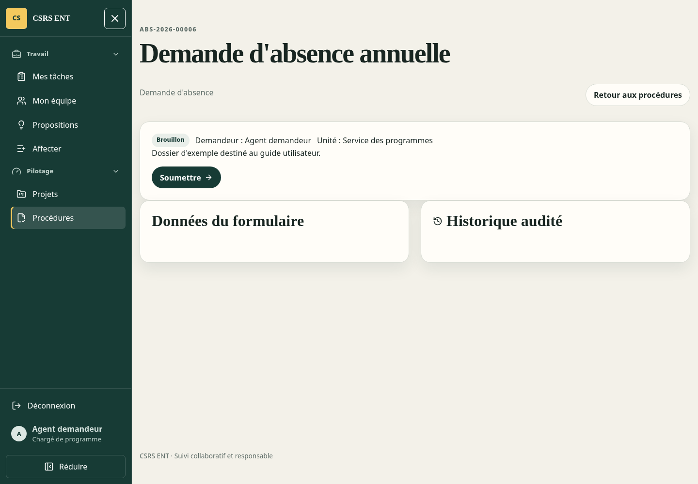

#+CAPTION: Historique immuable d'une soumission et de ses décisions.
#+ATTR_HTML: :alt "Historique audité d'un dossier de procédure" :width "100%"
#+ATTR_LATEX: :width 0.95\linewidth :placement [H]
#+ATTR_ODT: :width 16.0
#+ATTR_ORG: :width 1000
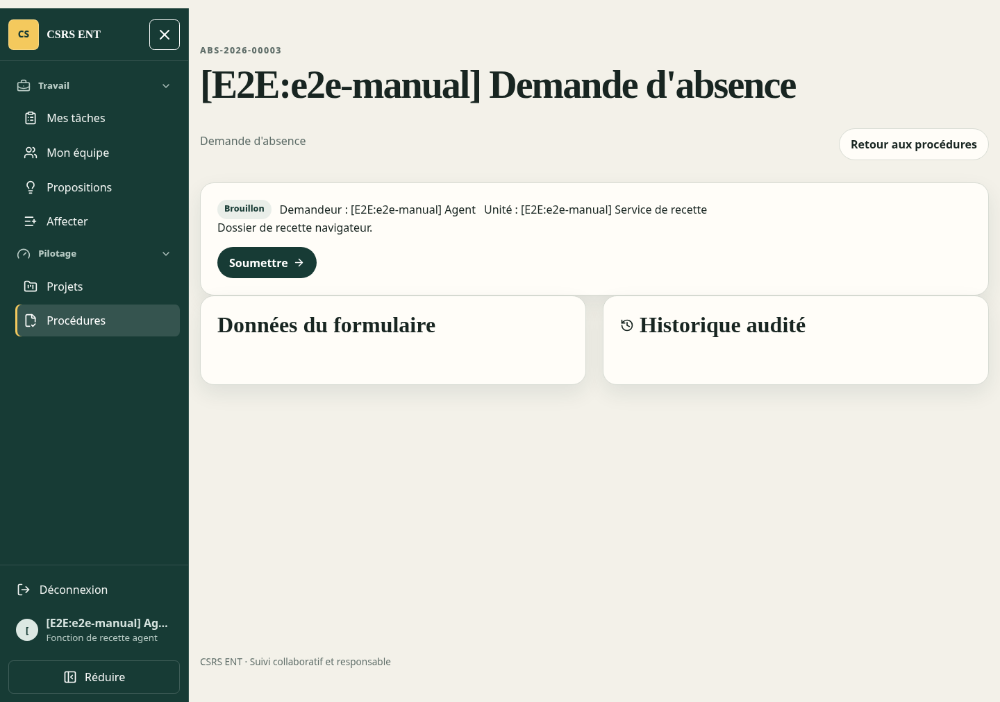

** Bon de sortie de fonds
:PROPERTIES:
:CUSTOM_ID: proc-bsf
:END:

Le bon de sortie de fonds, ou BSF, sert à demander le décaissement d'une dépense rattachée à un projet et à une ligne budgétaire. Avant de commencer, réunir l'objet de la dépense, le montant, le bénéficiaire et les justificatifs disponibles : ordre de mission, termes de référence, budget, contrat, convention, facture ou demande d'achat.

*** Créer et soumettre le BSF

1. Ouvrir =Procédures=, sélectionner =Nouveau dossier= puis =Bon de sortie de fonds=.
2. Sélectionner le projet puis une ligne budgétaire appartenant à ce projet.
3. Indiquer le bénéficiaire, l'objet précis du décaissement et le montant demandé.
4. Ajouter les pièces justificatives utiles et sélectionner =Créer le brouillon=.
5. Relire le dossier puis sélectionner =Soumettre=. Le dossier est transmis au contrôle financier; il ne faut pas créer une seconde demande pour la même dépense.

*** Suivre les visas et les corrections

| Ordre | Intervenant | Action attendue | Résultat visible |
|-------+-------------+-----------------+-----------------|
| 1 | Contrôle financier | Vérifier la capacité budgétaire et la situation comptable | Approbation ou retour motivé au demandeur |
| 2 | Demandeur | Vérifier et viser le BSF préparé | Transmission au responsable finances |
| 3 | Responsable finances | Contrôler et viser | Transmission à la DAF |
| 4 | DAF | Vérifier et viser | Transmission à la comptabilité du projet |
| 5 | Comptabilité du projet | Contrôler le dossier financier | Transmission au DG ou demande de correction |
| 6 | Direction générale | Approuver avec la confirmation électronique demandée | Autorisation de paiement et réservation budgétaire |
| 7 | Finances / caisse | Indiquer la date réellement exécutée et confirmer le paiement | Dossier =Terminé= et événement de paiement audité |

Lorsqu'une correction est demandée, le motif apparaît dans le dossier. Le demandeur corrige le même BSF puis sélectionne =Soumettre à nouveau=. Les visas et retours antérieurs restent dans l'historique; il ne faut ni supprimer le dossier ni recommencer le circuit.

*** Comprendre les contrôles de paiement

- Jusqu'à =200 000 FCFA= inclus, Odoo classe automatiquement le paiement en =Espèces=.
- Au-delà de =200 000 FCFA=, Odoo classe automatiquement le paiement en =Chèque=. Le BSF ne demande actuellement pas de numéro de chèque.
- L'approbation DG réserve une seule fois le montant sur la ligne budgétaire. Si le disponible est insuffisant ou si le dossier a été modifié entre-temps, Odoo refuse l'opération.
- La date de paiement doit être un mardi, un jeudi ou un vendredi et ne peut pas être future.
- Le processus de référence prévoit l'élaboration des BSF le lundi et le mercredi et vise un paiement dans les trois jours. Ces deux délais sont des consignes d'organisation; l'application ne bloque pas la saisie sur les autres jours.

#+CAPTION: BSF de 250 000 FCFA prêt au paiement par chèque, avec date et action réservées aux finances.
#+ATTR_HTML: :alt "Écran de préparation du paiement d'un bon de sortie de fonds" :width "100%"
#+ATTR_LATEX: :width 0.95\linewidth :placement [H]
#+ATTR_ODT: :width 16.0
#+ATTR_ORG: :width 1000
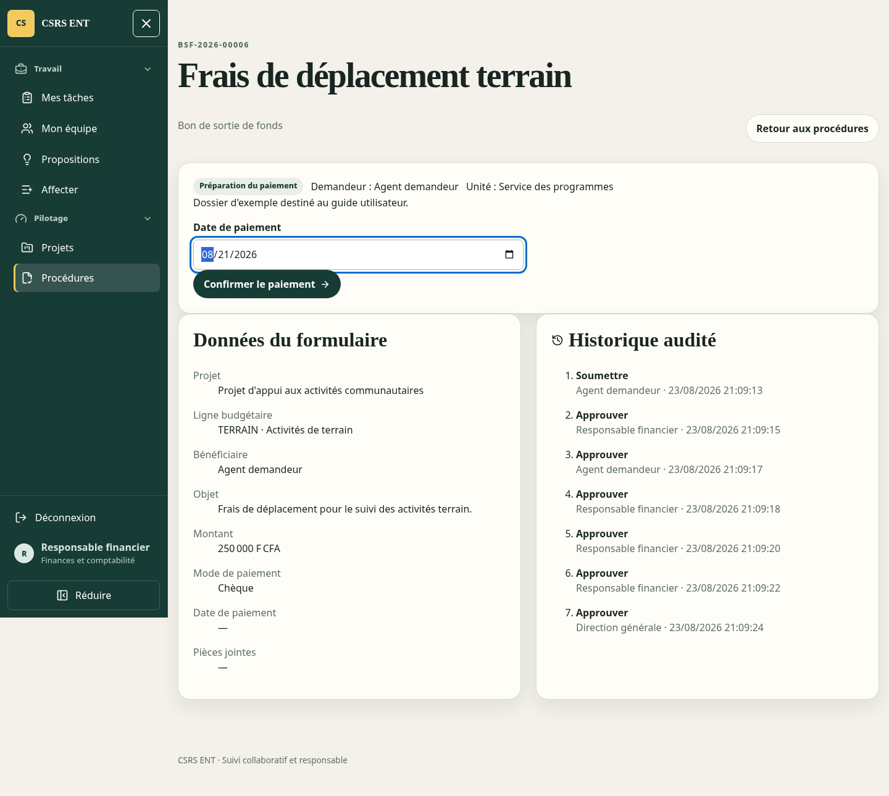

Après paiement, vérifier que l'état est =Terminé=, que le mode et la date sont affichés et que l'historique contient la confirmation du paiement. Cette trace permet au demandeur, aux finances et aux responsables autorisés de retrouver le circuit sans consulter une comptabilité parallèle.

#+CAPTION: Historique audité du BSF après confirmation du paiement.
#+ATTR_HTML: :alt "Historique des visas et du paiement d'un bon de sortie de fonds" :width "100%"
#+ATTR_LATEX: :width 0.78\linewidth :placement [H]
#+ATTR_ODT: :width 13.0
#+ATTR_ORG: :width 820
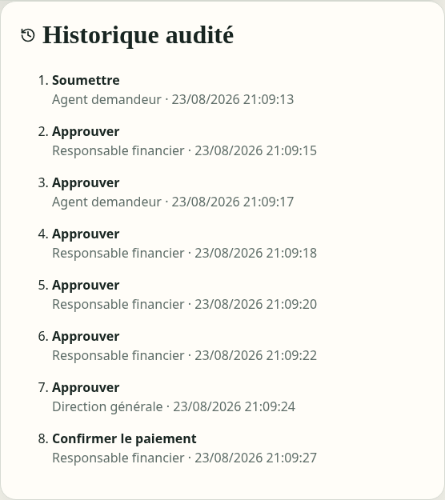

** Demande d'achat
:PROPERTIES:
:CUSTOM_ID: proc-da
:END:

La demande d'achat, ou DA, sert à obtenir l'autorisation puis à suivre l'achat d'un produit ou d'un service. Le demandeur décrit le besoin; la cellule achats renseigne ensuite les fournisseurs, les cotations et les données nécessaires au bon de commande.

*** Créer et faire approuver la demande

1. Ouvrir =Procédures=, sélectionner =Nouveau dossier= puis =Demande d'achat=.
2. Décrire clairement le besoin, sélectionner le projet et sa ligne budgétaire, puis indiquer la quantité et le montant estimé.
3. Ajouter les justificatifs disponibles, créer le brouillon, le relire puis sélectionner =Soumettre=.
4. La DAF approuve, demande une correction ou rejette la demande. Une DA approuvée est transmise au DG.
5. Le DG approuve avec la confirmation électronique demandée, demande une correction ou rejette. Seule une DA approuvée par le DG atteint la cellule achats.

Une demande de correction renvoie le même dossier au demandeur avec un motif obligatoire. Après modification, utiliser =Soumettre à nouveau= afin de conserver l'historique complet.

*** Comparer les cotations et préparer la commande

1. Le responsable des achats ouvre le dossier à l'étape =Traitement achat=.
2. Pour chaque offre reçue, il sélectionne le fournisseur, saisit la référence, la date et le montant puis joint le document de cotation.
3. Il sélectionne la cotation retenue, le produit ou service, la quantité commandée et le montant négocié, puis enregistre la préparation.
4. Il sélectionne =Créer le bon de commande=. Odoo crée et confirme un bon de commande natif lié à la DA; une seconde commande ne peut pas être créée pour le même dossier.

#+CAPTION: Comparaison des cotations et préparation du bon de commande par la cellule achats.
#+ATTR_HTML: :alt "Cotation retenue, produit, quantité et montant négocié d'une demande d'achat" :width "100%"
#+ATTR_LATEX: :width 0.82\linewidth :placement [H]
#+ATTR_ODT: :width 14.0
#+ATTR_ORG: :width 900
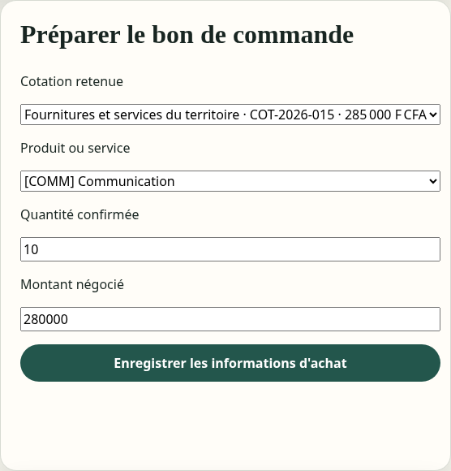

*** Enregistrer la livraison, la facture et le paiement

| Ordre | Intervenant | Informations et preuve obligatoires | Action |
|-------+-------------+-------------------------------------+--------|
| 1 | Cellule achats | Référence, date et justificatif de livraison | =Confirmer la livraison= |
| 2 | Cellule achats | Référence, date, montant et document de facture | =Enregistrer la facture= |
| 3 | Finances | Référence, date, montant et preuve de paiement | =Confirmer le paiement= |

Le montant payé doit être exactement égal au montant de la facture. Le rapprochement entre la facture et le montant négocié reste un contrôle humain de la cellule achats et des finances. L'approbation de la DA ne réserve pas automatiquement le budget : la disponibilité de la ligne doit être contrôlée avant de créer le bon de commande.

Le dossier terminé affiche le fournisseur retenu, le produit ou service, le montant négocié, le numéro du bon de commande, les cotations et les trois preuves. Les documents et événements audités ne peuvent pas être supprimés pour réécrire le parcours.

#+CAPTION: DA terminée avec bon de commande, livraison, facture, paiement et historique audité.
#+ATTR_HTML: :alt "Dossier d'achat terminé avec bon de commande et preuves" :width "100%"
#+ATTR_LATEX: :width 0.95\linewidth :placement [H]
#+ATTR_ODT: :width 16.0
#+ATTR_ORG: :width 1000
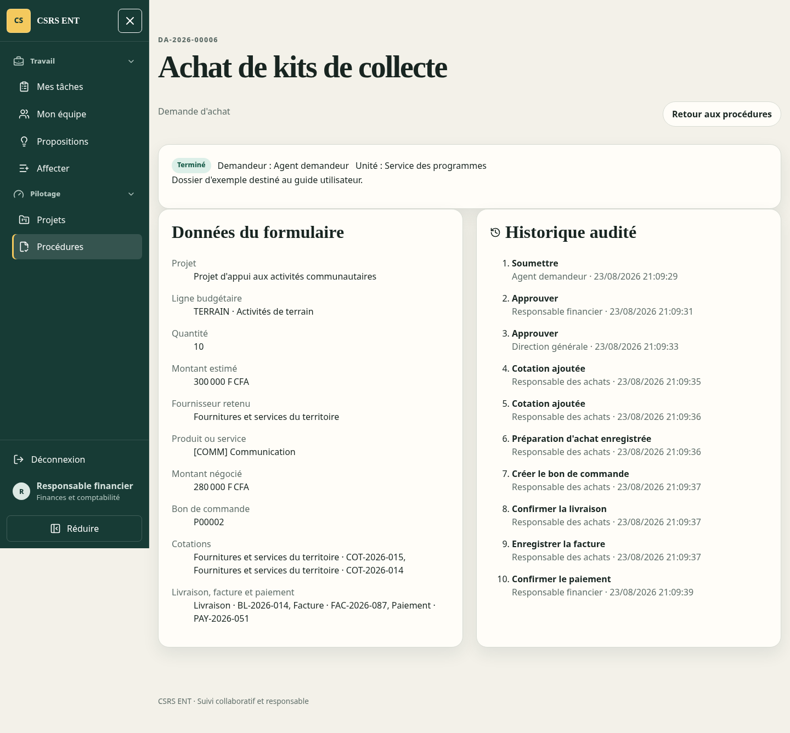

** Demande d'absence

Champs principaux: agent, intérimaire, dates, contact d'urgence, destination et service facultatifs.

| Ordre | État / responsable | Action produite |
|-------+--------------------+-----------------|
| 1 | Demandeur | Soumettre |
| 2 | Responsable principal | Approuver ou demander correction |
| 3 | RH | Approuver ou demander correction |
| 4 | DG | Approuver avec confirmation électronique |
| 5 | Secrétariat | Terminer le dossier |

** Ordre de mission

Champs principaux: destination, objet, départ, retour, transport et besoin de véhicule.

| Ordre | État / responsable | Action produite |
|-------+--------------------+-----------------|
| 1 | Demandeur | Soumettre |
| 2 | Assistance | Approuver ou demander correction |
| 3 | DG | Approuver avec confirmation électronique |
| 4 | Secrétariat | Diffuser |
| 5 | Comptabilité | Approuver |
| 6 | Parc automobile | Terminer si un véhicule est requis |

Sans véhicule requis, le dossier se termine automatiquement après l'approbation comptable et conserve un événement expliquant l'absence d'étape automobile.

** Notification de paiement

Champs principaux: nature du paiement, date, émetteur, banques, numéro de chèque et preuve PDF ou image.

| Ordre | État / responsable | Action produite |
|-------+--------------------+-----------------|
| 1 | Demandeur | Soumettre |
| 2 | Comptabilité | Notifier le bénéficiaire |
| 3 | Bénéficiaire / demandeur | Accuser réception et terminer |

** Visa ou prolongation

Champs principaux: visiteur, nationalité, passeport, nouveau visa ou prolongation, dates souhaitées et référence MAE facultative.

| Ordre | État / responsable | Action produite |
|-------+--------------------+-----------------|
| 1 | Demandeur | Soumettre |
| 2 | Assistance de recherche | Approuver ou demander correction |
| 3 | I2A | Approuver ou demander correction |
| 4 | DG | Approuver avec confirmation électronique |
| 5 | Secrétariat | Transmettre au MAE |
| 6 | Secrétariat | Terminer le suivi MAE |

** Gestion des données

Champs principaux: objectifs, plan de gestion, classification, emplacement, date de conservation et éventuelle conservation légale motivée.

| Ordre | État / responsable | Action produite |
|-------+--------------------+-----------------|
| 1 | Demandeur | Soumettre |
| 2 | Systèmes IT | Valider ou demander correction |
| 3 | Qualité / conformité | Approuver ou demander correction |
| 4 | Gestionnaire de données | Réaliser le traitement actif puis demander l'audit |
| 5 | Qualité / conformité | Auditer et archiver |
| 6 | Gestionnaire de données | Clôturer la conservation |

Si =Conservation légale= est cochée, le motif devient obligatoire. Une classification sensible impose d'appliquer les règles internes d'accès en plus du circuit affiché.

* Parcours par rôle

** Agent

1. Appliquer [[#proc-connexion][Se connecter et se déconnecter]].
2. Consulter ses engagements avec [[#proc-tableau-bord][Choisir la période et lire le tableau de bord]].
3. Enregistrer l'avancement selon [[#proc-progression][Mettre à jour la progression et publier une observation]].
4. Proposer un engagement selon [[#proc-proposer-tache][Proposer une tâche]].
5. Mettre à jour son cahier des charges selon [[#proc-equipe][Consulter l'équipe et le profil professionnel]].
6. Proposer un projet selon [[#proc-proposer-projet][Proposer un projet]].
7. Créer et suivre ses démarches selon [[#proc-dossier][Créer et suivre un dossier]].

** Responsable principal

1. Cumuler les opérations personnelles de l'agent.
2. Consulter le périmètre avec [[#proc-equipe][Consulter l'équipe et le profil professionnel]].
3. Affecter un engagement avec [[#proc-affecter][Créer ou modifier directement une tâche]].
4. Examiner les propositions avec [[#proc-examiner-proposition][Examiner, corriger et accepter une proposition]].
5. Prendre les décisions à 100 % selon [[#proc-decision-tache][Valider, remettre en reprise ou clôturer une tâche]].
6. Traiter les demandes d'absence de ses collaborateurs et superviser les projets visibles.

** Responsable secondaire

Le responsable secondaire consulte les personnes et tâches couvertes par sa délégation et publie des observations. Il ne doit pas affecter, modifier la progression, accepter une proposition, valider une tâche ni clôturer à la place du responsable principal.

** RH, secrétariat et Direction générale

Les RH appliquent [[#proc-absence][Déclarer, modifier ou annuler une indisponibilité]] et interviennent dans les demandes d'absence. Le secrétariat applique [[#proc-visiteurs][Enregistrer les visiteurs]], [[#proc-agenda][Préparer le brouillon et choisir la période]] et [[#proc-agenda-pdf][Générer, archiver et consulter les PDF]], puis traite les étapes de procédure qui lui sont adressées. La DG autorise les projets, valide électroniquement les sections et dossiers, supervise son périmètre et consulte les archives d'agenda.

** Finances, achats, conformité, données et parc automobile

Chaque spécialiste ouvre =Procédures= et traite seulement les dossiers dont l'état courant correspond à son rôle. Les finances contrôlent aussi les sections financières de projet. La conformité contrôle les sections conformité et les étapes qualité/I2A. Les achats exécutent les commandes et réceptions. Le gestionnaire de données traite et archive les dossiers de données. Le parc automobile termine uniquement les missions nécessitant un véhicule.

* Administration IT

** Filtrer et supprimer des tâches
:PROPERTIES:
:CUSTOM_ID: proc-admin-taches
:END:

1. Ouvrir =Gérer les tâches=.
2. Filtrer par recherche, statut ou collaborateur.
3. Sélectionner des lignes, toute la page avec la case d'en-tête ou une plage avec =Maj clic=.
4. Sélectionner =Supprimer=.
5. Saisir un motif et le mot exact =SUPPRIMER=.
6. Sélectionner =Supprimer définitivement= et conserver le numéro du journal affiché.

La suppression est définitive pour les tâches sélectionnées, mais l'audit conserve leur identité et état. Une révision devenue ancienne annule tout le lot afin d'éviter une suppression partielle.

#+CAPTION: Sélection et confirmation auditée de suppression de tâches.
#+ATTR_HTML: :alt "Administration IT des tâches avec sélection et confirmation" :width "100%"
#+ATTR_LATEX: :width 0.95\linewidth :placement [H]
#+ATTR_ODT: :width 16.0
#+ATTR_ORG: :width 1000
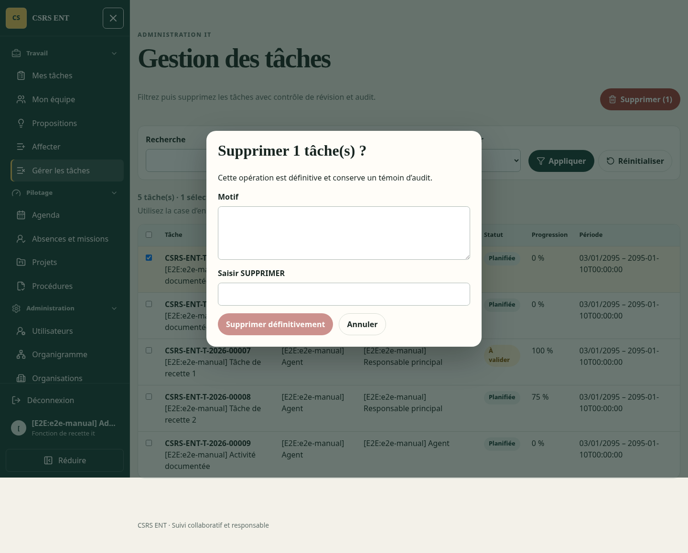

** Rechercher et traiter plusieurs comptes
:PROPERTIES:
:CUSTOM_ID: proc-admin-comptes
:END:

1. Ouvrir =Utilisateurs=.
2. Filtrer par texte, état actif/inactif ou unité.
3. Sélectionner les comptes autorisés avec les mêmes commandes de page et de plage.
4. Choisir =Désactiver= pour conserver comptes et historique sans accès.
5. Choisir =Supprimer= uniquement pour des comptes natifs déjà inactifs et sans historique métier.
6. Saisir le motif et la confirmation demandée.

Le compte administrateur Odoo protégé ne peut pas être réinitialisé ou supprimé depuis CSRS ENT. Après une désactivation, la liste passe automatiquement aux comptes inactifs pour rendre le résultat visible.

#+CAPTION: Liste des utilisateurs, filtres et actions groupées.
#+ATTR_HTML: :alt "Gestion des utilisateurs avec filtres et sélection multiple" :width "100%"
#+ATTR_LATEX: :width 0.95\linewidth :placement [H]
#+ATTR_ODT: :width 16.0
#+ATTR_ORG: :width 1000
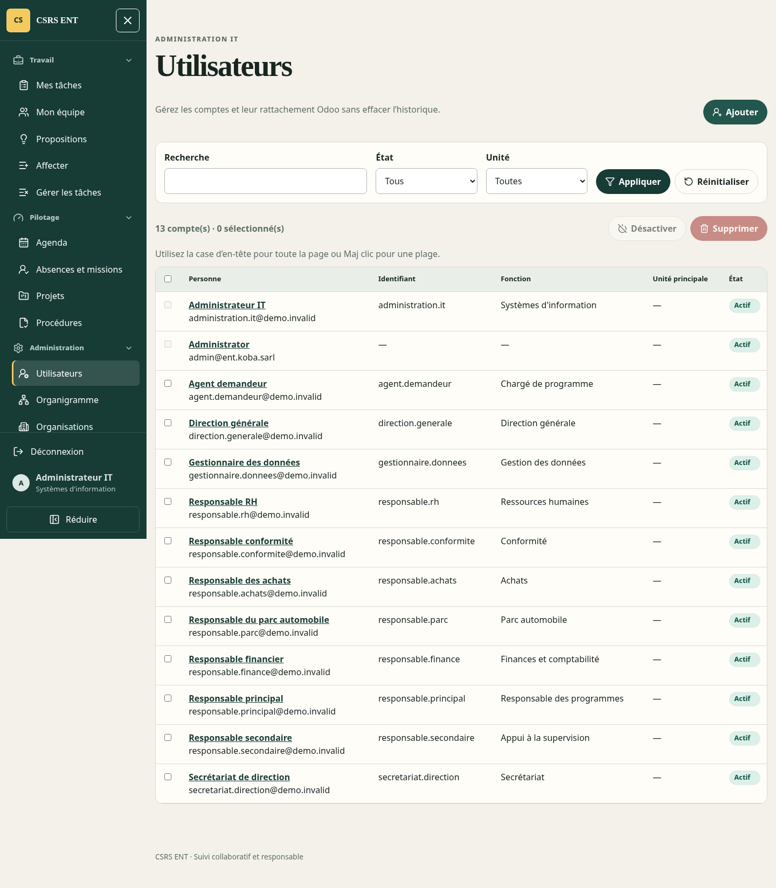

** Ajouter ou modifier une personne
:PROPERTIES:
:CUSTOM_ID: proc-admin-personne
:END:

1. Sélectionner =Ajouter= ou ouvrir un compte existant.
2. Saisir prénom, nom, email, identifiant court, fonction et téléphone.
3. Choisir la direction d'agenda: programmes, administration, recherche ou non classée.
4. Conserver l'inclusion dans les agendas sauf exclusion institutionnelle explicite.
5. Choisir les unités actuelles, une unité principale et le responsable principal.
6. Saisir la date d'effet et enregistrer.
7. Dans =Accès au compte=, créer ou réinitialiser le mot de passe temporaire si nécessaire.
8. Copier immédiatement la valeur affichée une seule fois et la transmettre par un canal sûr.
9. Réactiver un compte inactif depuis la même fiche lorsque l'accès doit être restauré.

Changer le responsable principal clôt la ligne hiérarchique actuelle, crée la nouvelle à la date d'effet et transfère les tâches actives avec une nouvelle révision. Contrôler ensuite =Mon équipe= avec le nouveau responsable.

#+CAPTION: Fiche d'identité, d'agenda, d'organigramme et d'accès d'un compte.
#+ATTR_HTML: :alt "Formulaire complet d'administration d'un utilisateur" :width "100%"
#+ATTR_LATEX: :width 0.95\linewidth :placement [H]
#+ATTR_ODT: :width 16.0
#+ATTR_ORG: :width 1000
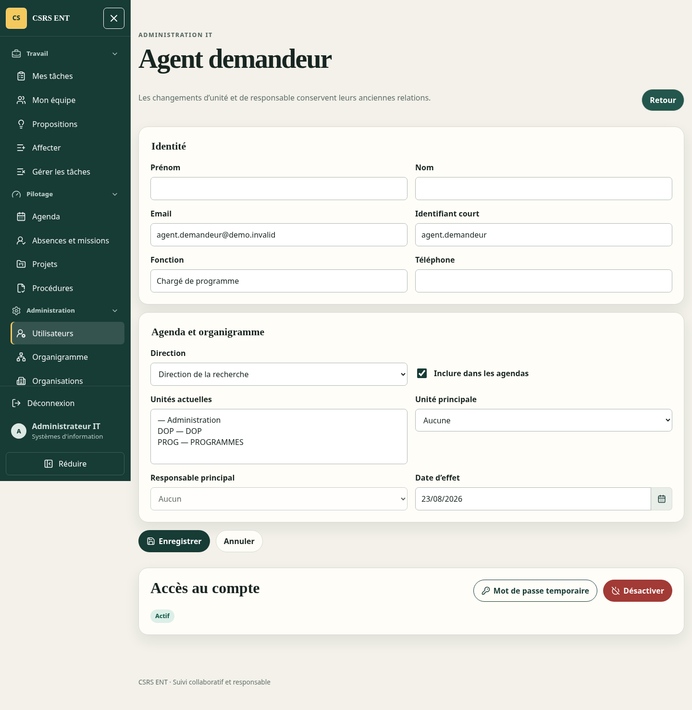

** Gérer les unités et délégations
:PROPERTIES:
:CUSTOM_ID: proc-admin-organigramme
:END:

Pour une unité, saisir un code stable, les noms court et long, le type, le parent, l'ordre et l'état actif. Sélectionner =Modifier= pour charger une ligne existante dans le formulaire. Odoo refuse un code dupliqué, un second parent incohérent et toute boucle hiérarchique.

Pour une délégation, choisir la personne, l'unité, le rôle, la portée =Cette unité= ou =Unité et sous-unités=, le début, la fin facultative et le motif. Pour la retirer, sélectionner =Révoquer= et saisir un motif. Ne pas supprimer la ligne: les dates, l'auteur et la révocation appartiennent à l'historique.

#+CAPTION: Édition des unités et délégations datées de l'organigramme.
#+ATTR_HTML: :alt "Organigramme avec formulaire d'unité et délégation" :width "100%"
#+ATTR_LATEX: :width 0.95\linewidth :placement [H]
#+ATTR_ODT: :width 16.0
#+ATTR_ORG: :width 1000
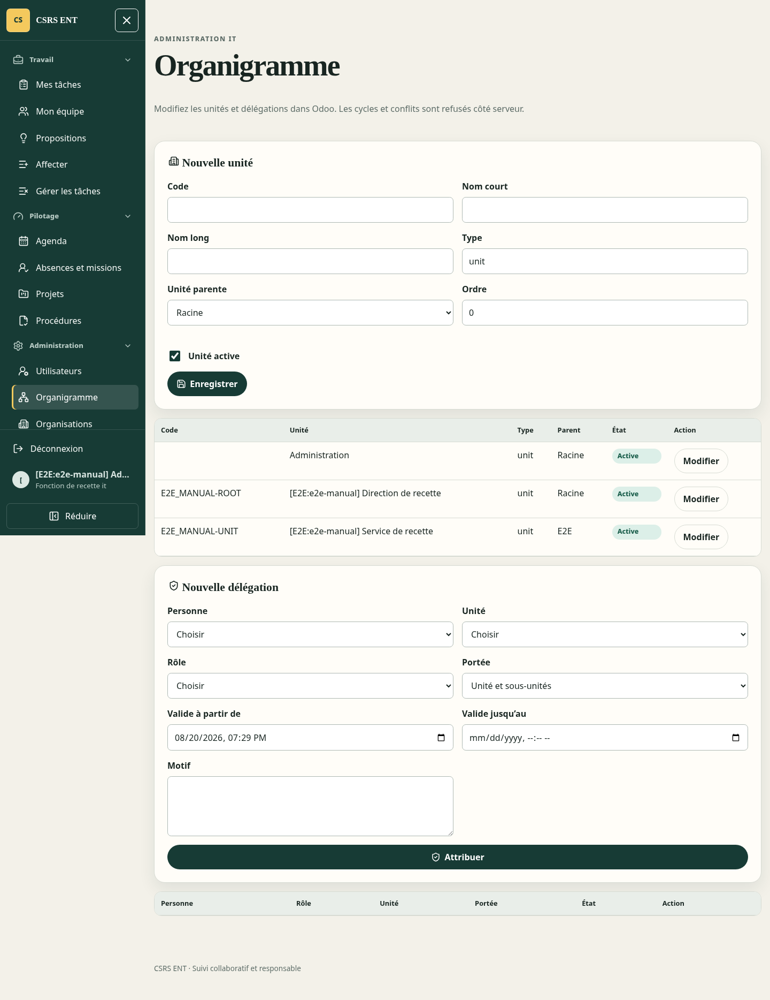

** Gérer les bailleurs et partenaires
:PROPERTIES:
:CUSTOM_ID: proc-admin-partenaires
:END:

1. Ouvrir =Organisations=.
2. Saisir le nom, l'email et le téléphone puis sélectionner =Créer=.
3. Utiliser =Modifier= pour corriger les coordonnées avec le jeton d'état courant.
4. Utiliser =Archiver= pour retirer l'organisation des nouvelles sélections.
5. Ouvrir =Archivées= puis =Réactiver= si elle doit redevenir sélectionnable.

L'archivage ne retire pas l'organisation des projets historiques.

#+CAPTION: Création, modification et archivage des organisations partenaires.
#+ATTR_HTML: :alt "Administration des bailleurs et partenaires Odoo" :width "100%"
#+ATTR_LATEX: :width 0.95\linewidth :placement [H]
#+ATTR_ODT: :width 16.0
#+ATTR_ORG: :width 1000
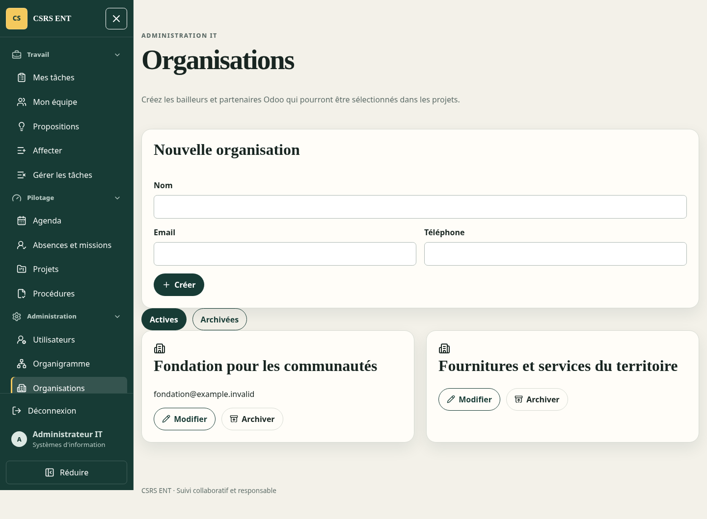

* Annexe opérateur - Accès Odoo et préproduction

** Accéder à l'interface Odoo native

L'interface native de préproduction est publiée à =https://preprod.odoo.ent.koba.sarl/web/login=. Le navigateur demande d'abord l'authentification HTTP Basic configurée par Nginx, puis Odoo demande un compte applicatif distinct.

Le mot de passe maître Odoo administre les bases et n'est pas le mot de passe d'un utilisateur. Les variables de bootstrap d'un fichier =.env= peuvent ne plus correspondre au mot de passe actuel d'un compte lorsque le volume Odoo persistant existe déjà. Pour un accès humain, utiliser un compte Odoo actif ou appliquer une réinitialisation explicite et auditée; ne jamais redéployer uniquement pour essayer un secret.

Ne pas reproduire les valeurs de Basic Auth, de compte Odoo, de mot de passe maître ou de base dans ce manuel. L'accès natif reste réservé aux opérateurs autorisés; les utilisateurs métier utilisent =/app/=.

** Promouvoir et déployer en préproduction

1. Développer sur une branche de fonctionnalité issue de =dev=.
2. Ouvrir une pull request vers =dev= et attendre =Promotion policy=, =Python=, =Frontend= et =Compose and Odoo=.
3. Merger la pull request sans forcer la branche.
4. Ouvrir une pull request de =dev= vers =preprod=.
5. Attendre les mêmes contrôles et merger exactement le commit validé.
6. Approuver l'environnement GitHub =preprod= lorsque le job attend un reviewer.
7. Le job =Deploy preproduction= ouvre une connexion SSH restreinte et transmet uniquement le SHA complet de =preprod=.
8. Le wrapper serveur sauvegarde les données, prépare une version immuable, construit les services, vérifie =/healthz/= et =/readyz/= puis bascule le lien =current=.
9. Vérifier que le SHA du répertoire courant correspond à =preprod= et que les conteneurs sont sains.

Le chemin normal ne consiste pas à lancer le script de déploiement depuis le checkout =dev=. Ne jamais utiliser =docker compose down -v=, supprimer les volumes Odoo/PostgreSQL ou contourner la politique de promotion.

** Contrôler le service après déploiement

Depuis un poste autorisé, vérifier sans afficher de secret:

#+begin_src sh
curl --fail --silent --show-error https://preprod.ent.koba.sarl/healthz/
curl --fail --silent --show-error https://preprod.ent.koba.sarl/readyz/
curl --fail --silent --show-error --output /dev/null https://preprod.ent.koba.sarl/app/
#+end_src

Sur l'hôte, contrôler le lien de version et l'état des conteneurs sans lire le fichier d'environnement:

#+begin_src sh
readlink -f /srv/apps/csrs-ent-preprod/current
docker ps --filter name=csrs_ent_preprod --format '{{.Names}}\t{{.Status}}'
#+end_src

Un échec avant la bascule doit laisser l'ancienne version disponible. Diagnostiquer dans l'ordre: workflow GitHub, approbation d'environnement, sauvegarde, construction, migrations Odoo, santé locale, Nginx/TLS puis HTTP public. Ne pas lancer un second déploiement tant que le premier détient potentiellement le verrou.

* Résoudre les difficultés courantes

#+ATTR_LATEX: :align p{0.29\linewidth}p{0.64\linewidth}
| Situation | Contrôle et action |
|-----------+--------------------|
| Un menu attendu est absent | Vérifier le rôle Odoo, la hiérarchie, la délégation et ses dates; ne pas contourner avec une URL directe. |
| Une tâche attendue n'apparaît pas | Contrôler la semaine ou le mois et le filtre de l'équipe. |
| Une baisse de progression échoue | Ajouter l'observation obligatoire expliquant la baisse. |
| Une tâche à 100 % reste ouverte | Le responsable principal doit valider explicitement l'achèvement. |
| Une ressource a changé | Recharger, relire la nouvelle version et recommencer selon [[#proc-conflit][Comprendre les confirmations et conflits de révision]]. |
| Une proposition est rejetée | Lire le motif, modifier la même proposition puis la soumettre de nouveau. |
| Un fichier de profil est refusé | Vérifier le type autorisé et la limite de 5 Mo. |
| Une étape de projet reste verrouillée | Compléter les brouillons obligatoires précédents, notamment une activité du plan d'action ou une ligne financière. |
| Une section de projet est en lecture seule | Elle est soumise; attendre la vérification ou une correction motivée. |
| Une action de dossier est absente | Le dossier attend un autre rôle ou le compte n'a pas la délégation active. |
| Une annulation d'absence échoue | Conserver la ligne visible, relire le message et réessayer avec la révision courante. |
| Un agenda ne se met pas à jour | Le dernier aperçu reste affiché; contrôler la période puis utiliser =Réessayer=. |
| Une personne est dans tous les agendas | Renseigner sa direction d'agenda ou son exclusion explicite dans la fiche utilisateur. |
| Un partenaire manque dans un projet | Le créer dans =Administration > Organisations=; ne pas saisir une société comme utilisateur. |
| Un compte ne peut pas être supprimé | Le désactiver; l'historique métier ou le statut protégé interdit la suppression. |
| Odoo refuse le mot de passe du fichier d'environnement | Distinguer le bootstrap, le mot de passe maître et le compte persistant; réinitialiser le compte sans redéployer. |
| Le site public échoue mais les conteneurs sont sains | Contrôler Nginx, le certificat, le nom d'hôte et les routes après les sondes locales. |

* Régénérer les captures                                               :noexport:

Les captures utilisent les douze comptes et les enregistrements fictifs du jeu =e2e-manual=. Le wrapper refuse toute cible autre que =localhost= ou =127.0.0.1=, exige la confirmation exacte de la base locale, peuple uniquement les références suivies du jeu, lit le mot de passe protégé sans l'afficher puis nettoie le jeu même après un échec.

L'environnement Compose local doit déjà répondre sur le port manuel. Exécuter:

#+begin_src sh
CSRS_E2E_CONFIRM_DATABASE=nom_exact_de_la_base_locale ./scripts/capture_manual.sh .env
#+end_src

Relire chaque image sous =docs/screenshots/= avant publication. Ne jamais remplacer la cible locale par la préproduction.

* Exporter le manuel                                                   :noexport:

Ouvrir =docs/MANUAL.org= dans Emacs et utiliser les commandes Org classiques:

- =C-c C-e o o= pour produire et ouvrir =docs/CSRS-ENT-Guide-utilisateur.odt=.
- =C-c C-e l p= pour produire =docs/CSRS-ENT-Guide-utilisateur.pdf= avec LuaLaTeX.

Les liens d'images sont relatifs au fichier Org. Les fichiers ODT et PDF sont des sorties de publication et ne doivent pas remplacer la source Org maintenue.
