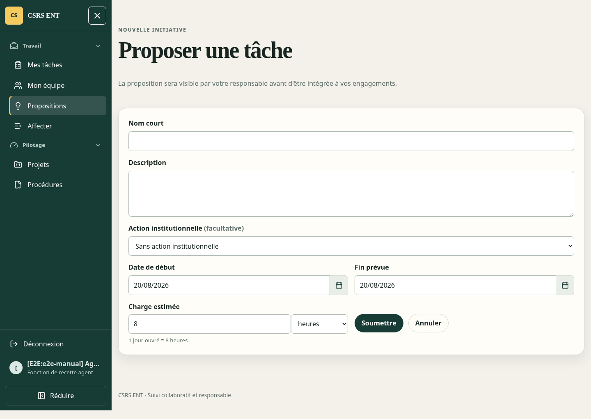
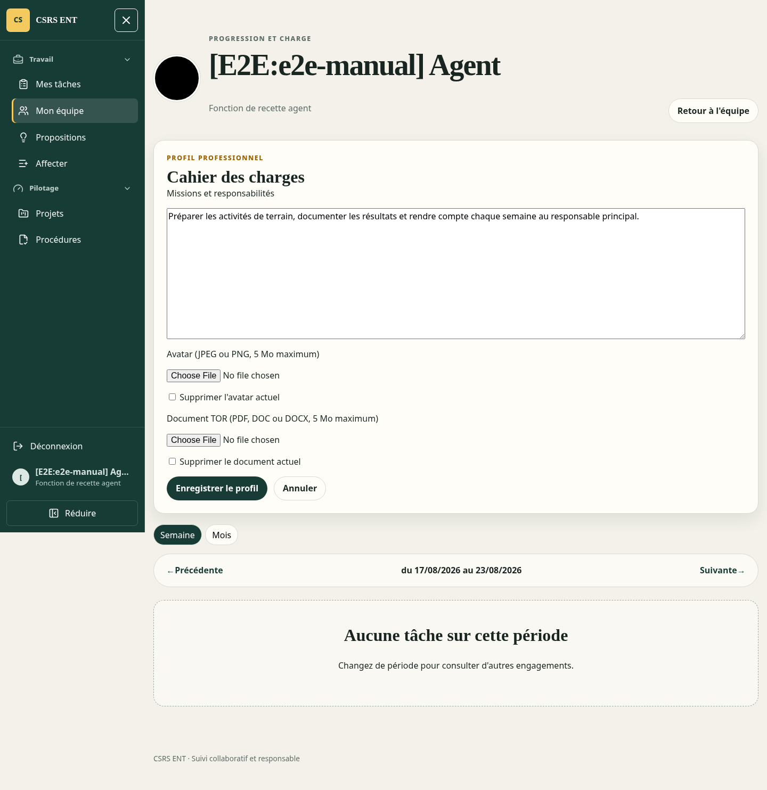
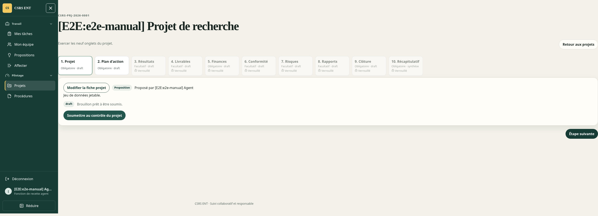
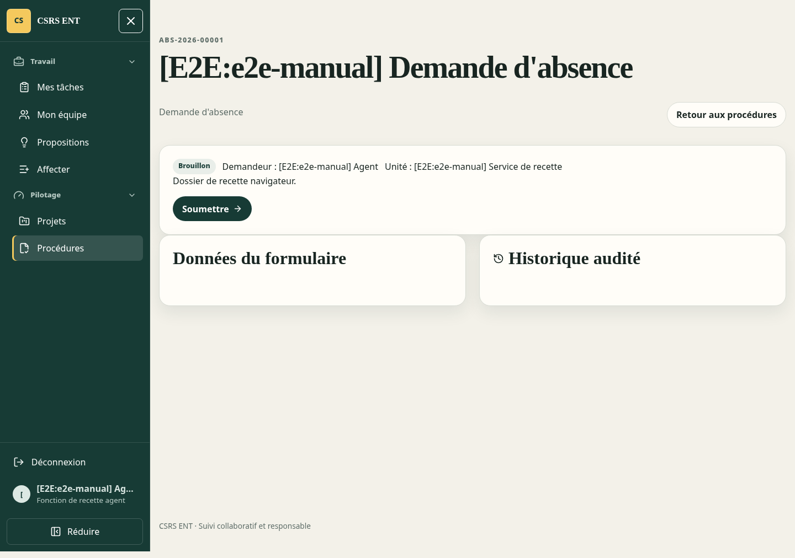

#+title: CSRS ENT - Guide utilisateur
#+author: CSRS
#+language: fr
#+date:
#+startup: overview
#+options: toc:2 num:2
#+export_file_name: CSRS-ENT-Guide-utilisateur
#+latex_compiler: lualatex

# Export ODT : C-c C-e o o
# Export PDF : C-c C-e l p

Les captures de ce guide utilisent uniquement des comptes et dossiers de démonstration.

* Connexion

Ouvrir =https://preprod.ent.koba.sarl/app/=. Saisir l'adresse email ou l'identifiant court habituel et le même mot de passe que celui repris depuis l'ancienne application. =/= et =/connexion/= redirigent vers cette page unique.

Si CSRS ENT demande un changement de mot de passe, choisir un nouveau mot de passe depuis l'écran affiché avant d'utiliser les autres fonctions.

* Tâches

Le tableau de bord présente les tâches de la semaine ou du mois, leur charge, leur progression et leur échéance. Ouvrir une carte pour consulter le graphique, la description et les observations.

Un responsable principal peut créer et modifier une tâche pour un agent de son périmètre. L'agent enregistre sa progression avec une observation; chaque saisie est conservée dans l'historique. Une progression à 100 % place la tâche en attente de validation. Le responsable principal peut alors la valider, la remettre en correction ou la clôturer avant achèvement avec un motif. Un responsable secondaire consulte et commente sans valider ni fermer.

En cas de modification concurrente, CSRS ENT refuse l'écriture devenue ancienne et demande de recharger la tâche. Cette protection évite d'écraser une modification plus récente.

* Propositions de tâches

Chaque agent peut proposer une tâche en indiquant le titre, les dates, la charge et la description. Le responsable consulte la proposition et peut la valider, la rejeter avec un motif ou demander une correction. Une proposition corrigée est renvoyée au responsable. La validation crée une tâche Odoo en une seule opération et conserve le lien avec la proposition d'origine.

La charge est saisie en =heures= par défaut. Choisir =jours= lorsque cette unité est plus naturelle; CSRS ENT applique l'équivalence affichée sous le champ, actuellement =1 jour ouvré = 8 heures=. Une valeur décimale, par exemple =1,5 heure=, reste autorisée. Le même choix est proposé dans les affectations directes et dans les activités du plan d'action d'un projet.

#+caption: Saisir une charge en heures ou en jours dans une proposition
#+attr_odt: :width 16cm
#+attr_latex: :width 0.92\textwidth

* Équipe

La rubrique =Équipe= présente les agents visibles selon l'organigramme et les délégations Odoo. Elle permet de consulter leurs tâches et leur charge. Les droits affichés dans CSRS ENT sont toujours contrôlés de nouveau dans Odoo lors de chaque opération.

Pour compléter son profil professionnel, ouvrir sa ligne dans =Mon équipe=, choisir =Voir la fiche complète= puis =Modifier mon profil=. Le champ =Missions et responsabilités= reçoit le cahier des charges en texte. Il est aussi possible de remplacer l'avatar par une image JPEG ou PNG et de joindre le document TOR au format PDF, DOC ou DOCX; chaque fichier est limité à 5 Mo. Les cases de suppression retirent le fichier actuellement enregistré lors de la sauvegarde.

Seul l'employé modifie son propre profil. Les responsables autorisés peuvent consulter le cahier des charges et télécharger le document, sans le modifier. Une modification concurrente est refusée et impose de recharger la fiche avant de recommencer.

#+caption: Modifier son profil, son avatar et son cahier des charges
#+attr_odt: :width 16cm
#+attr_latex: :width 0.92\textwidth

* Absences, missions et visites

Les personnes autorisées déclarent les congés, absences et missions depuis =Absences et missions=. Ces périodes alimentent automatiquement l'aperçu d'agenda.

Le secrétariat enregistre l'arrivée d'un visiteur, le nombre de personnes et, si disponible, leurs noms. Le départ est ensuite marqué depuis la liste des visites en cours.

* Agendas de direction

La rubrique =Agendas= affiche l'aperçu hebdomadaire de la Direction des programmes ou de la Direction administrative. Le secrétariat complète le brouillon, contrôle les avertissements et génère le PDF.

Chaque génération crée une version immuable avec son PDF archivé. Une nouvelle correction produit une nouvelle version sans remplacer les documents précédents. Les versions restent accessibles depuis =Agendas archivés=.

* Projets de recherche

La rubrique =Projets= permet à tout agent de proposer un projet avec ses objectifs, dates, bailleur, partenaires et équipe. Le bailleur et les partenaires sont des organisations déjà enregistrées par l'administration IT : ils se choisissent dans une liste et ne créent jamais un compte utilisateur. Le champ =Engagements institutionnels= décrit ce que chaque institution apporte au projet, par exemple : « CSRS met le laboratoire et le personnel à disposition ; l'université partenaire facilite l'accès au terrain. »

Après autorisation du DG et désignation du chef de projet, le dossier suit un parcours de dix écrans numérotés : fiche projet, plan d'action, résultats, livrables, finances, conformité, risques, rapports, clôture et récapitulatif. Chaque écran indique s'il est obligatoire ou facultatif. Une étape obligatoire devient accessible dès que les brouillons obligatoires précédents sont complets; les écrans facultatifs restent disponibles sans bloquer la suite. Le bouton =Ouvrir le brouillon= permet de saisir l'étape active. Le porteur ou le chef de projet ajoute et modifie les éléments tant que l'onglet est en brouillon ou en correction; les activités du plan d'action deviennent des tâches Odoo suivies avec leur charge et leur progression. Le dernier écran récapitule les activités, le budget, la gouvernance et l'état des neuf sections.

#+caption: Parcours numéroté d'un projet, de la fiche au récapitulatif
#+attr_odt: :width 16cm
#+attr_latex: :width 0.92\textwidth

Chaque onglet suit le cycle =Brouillon → Soumis → Vérifié → Validé → Clôturé=. Le bouton de soumission précise son destinataire : contrôle du projet, contrôle financier ou conformité, puis le DG après vérification. Les onglets =Plan d'action= et =Finances= exigent respectivement au moins une activité et une ligne budgétaire avant la soumission. Une fois soumis, un onglet est en lecture seule jusqu'à une correction motivée du contrôleur. La validation finale appartient au DG, exige la phrase de confirmation affichée et crée une preuve électronique immuable. Une révision devenue ancienne est refusée.

La vue =À superviser= regroupe les projets du périmètre hiérarchique du responsable, y compris à travers plusieurs niveaux de l'organigramme. Le responsable, le DG et l'administration IT peuvent ouvrir et modifier ces projets, relire les sections, demander une correction motivée et archiver un projet avec un motif. L'archivage ne détruit ni le dossier ni son historique : le projet quitte les vues actives, reste accessible dans =Archivés= et crée une preuve d'audit immuable. Un agent extérieur au périmètre ne peut ni consulter ni modifier le projet.

* Procédures métier

La rubrique =Procédures= centralise les bons de sortie de fonds, demandes d'achat, absences, ordres de mission, notifications de paiement, visas et dossiers de gestion des données. Choisir =Nouveau dossier= puis le type de procédure : le formulaire adapte automatiquement ses champs. Renseigner l'objet, les données demandées et, si nécessaire, les justificatifs PDF, JPEG ou PNG, puis enregistrer le brouillon. Ouvrir ensuite le dossier et choisir =Soumettre= pour l'envoyer au premier destinataire.

Le dossier affiche toujours son état, son destinataire courant, les seules actions autorisées et l'=Historique audité=. Lorsqu'un contrôleur demande une correction, son motif est obligatoire; le demandeur corrige le même dossier puis le soumet de nouveau, sans perdre les événements antérieurs. Une révision devenue ancienne est refusée afin de ne pas écraser une décision plus récente. Les étapes sensibles sont limitées au rôle concerné et la validation DG exige la confirmation électronique affichée.

#+caption: Soumettre un dossier et suivre son circuit ainsi que son historique
#+attr_odt: :width 16cm
#+attr_latex: :width 0.92\textwidth

** Bon de sortie de fonds (BSF)

Le demandeur choisit =Bon de sortie de fonds=, renseigne l'objet et la justification, le bénéficiaire, le projet, la ligne budgétaire et le montant, puis enregistre et soumet le dossier. Pour un montant inférieur ou égal à =200 000 FCFA=, le paiement est automatiquement classé =Espèces=. Au-delà, il est classé =Chèque=. Ce classement est calculé dans Odoo et ne peut pas être contourné depuis l'interface.

Le dossier suit successivement le contrôle financier, le visa du demandeur, le responsable finances, la DAF, la comptabilité du projet et le DG. Chaque intervenant ouvre le même dossier, contrôle les données et justificatifs, puis choisit l'action affichée. Une demande de correction exige un motif et renvoie le dossier au demandeur sans supprimer l'historique. La validation DG réserve atomiquement le montant sur la ligne budgétaire : si le solde est devenu insuffisant ou si une autre opération a modifié la révision, Odoo refuse la validation au lieu de dépasser le budget.

Après validation, la finance prépare le paiement. Le caissier indique la date réellement exécutée et choisit =Payer=. Les paiements BSF sont autorisés uniquement le mardi, le jeudi ou le vendredi; une date future ou un autre jour est refusé. Le dossier terminé affiche le mode et la date de paiement ainsi que tout l'historique audité.

#+caption: Contrôler le mode, la ligne budgétaire et la date d'exécution d'un BSF
#+attr_odt: :width 16cm
#+attr_latex: :width 0.92\textwidth
[[file:screenshots/procedure-bsf-paiement.png]]

** Demande d'achat (DA)

Le demandeur choisit =Demande d'achat=, décrit le besoin, sélectionne le projet et sa ligne budgétaire, puis saisit la quantité et le montant estimé. Après soumission, la DAF contrôle la demande et le DG confirme électroniquement son approbation. Cette approbation autorise le traitement par la cellule achat, mais ne réserve pas le budget : la disponibilité doit donc être contrôlée avant de commander.

La cellule achat ouvre le dossier à l'étape =Traitement achat= et suit cette procédure :

1. Dans =Cotations fournisseurs=, ajouter chaque offre avec le fournisseur, la référence, la date, le montant et le justificatif reçu.
2. Sélectionner la cotation retenue, le produit ou service, la quantité et le montant négocié, puis enregistrer la préparation de commande.
3. Choisir =Commander=. Odoo crée et confirme un bon de commande natif lié au dossier; son numéro apparaît dans le récapitulatif et une seconde commande ne peut pas être créée pour la même DA.
4. À la livraison, enregistrer la référence, la date et le justificatif de réception, puis choisir =Réceptionner=.
5. À réception de la facture, enregistrer sa référence, sa date, son montant et son justificatif, puis choisir =Facturer=.
6. La finance enregistre enfin la référence, la date, le montant et la preuve de paiement, puis choisit =Payer=.

Le montant payé doit correspondre au montant de la facture. Le rapprochement entre la facture et le montant négocié reste un contrôle métier de la cellule achat et de la finance; Odoo ne le bloque pas automatiquement. Les preuves de réception, facture et paiement sont obligatoires, liées au même dossier et immuables après leur création. Toute action effectuée par un autre rôle, dans un ordre incorrect ou depuis une ancienne révision est refusée par Odoo.

#+caption: Sélectionner une cotation et suivre le bon de commande ainsi que les trois preuves d'une DA
#+attr_odt: :width 16cm
#+attr_latex: :width 0.92\textwidth
[[file:screenshots/procedure-da-commande-preuves.png]]

** Autres circuits

Les autres circuits appliqués sont les suivants :

- =Demande d'absence= : responsable hiérarchique, RH, DG, puis secrétariat pour clôture.
- =Ordre de mission= : assistance de recherche, DG, secrétariat, comptabilité, puis parc automobile.
- =Notification de paiement= : comptabilité, notification au bénéficiaire, puis accusé de réception du bénéficiaire.
- =Visa ou prolongation= : assistance de recherche, contrôle I2A, DG, secrétariat, puis suivi auprès du MAE.
- =Gestion des données= : validation des systèmes, contrôle qualité, traitement actif par le gestionnaire de données, audit, archivage, puis décision de conservation ou de suppression.

* Administration IT

L'administrateur IT dispose de =Gérer les tâches=, =Utilisateurs= et =Organigramme=. Ces rubriques ne sont pas visibles pour les autres rôles et chaque opération est de nouveau autorisée dans Odoo.

=Gérer les tâches= permet de filtrer les tâches puis de supprimer une sélection avec son motif, le mot de confirmation =SUPPRIMER= et le contrôle de la version courante. La suppression est définitive, mais un événement d'audit conserve l'identité des tâches supprimées et leur état au moment de l'opération.

=Utilisateurs= permet de créer ou modifier un compte, son unité principale, ses autres rattachements, son responsable et son classement dans les agendas. Une désactivation conserve l'historique. La suppression est limitée à un compte natif déjà inactif et sans historique métier. Le mot de passe temporaire n'est affiché qu'une fois et impose son remplacement à la connexion suivante.

=Organigramme= permet de créer, renommer, déplacer ou désactiver une unité, puis d'attribuer et révoquer les délégations datées. Une modification de responsable clôt l'ancienne ligne hiérarchique, ouvre la nouvelle et transfère les tâches actives avec une nouvelle révision. Odoo refuse les cycles et les mises à jour fondées sur une version ancienne.

=Organisations= permet de créer, modifier, rechercher ou archiver les bailleurs et partenaires utilisés dans les projets. L'archivage retire une organisation des nouvelles sélections sans effacer les projets historiques qui la mentionnent.

* Déconnexion et assistance

Utiliser =Se déconnecter= dans le menu. En cas d'erreur d'autorisation, faire vérifier le rôle, la ligne hiérarchique ou la délégation dans Odoo; un bouton masqué dans l'interface ne constitue jamais à lui seul une autorisation.
